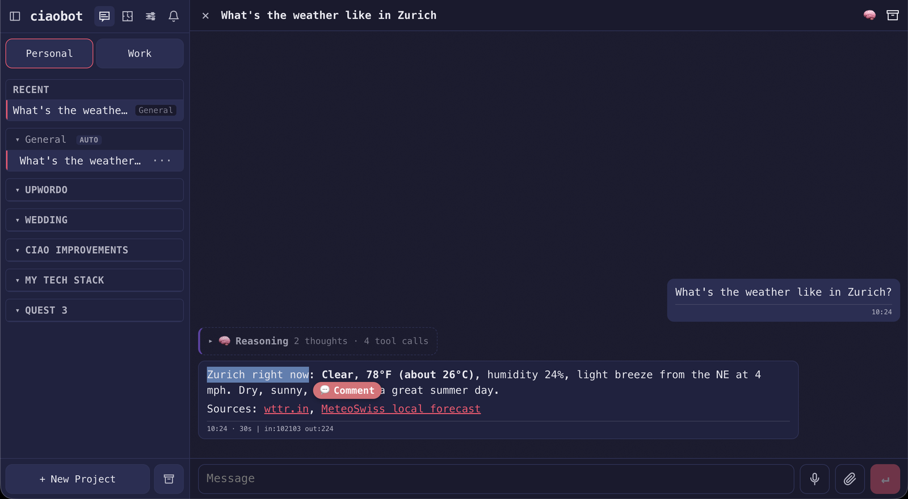
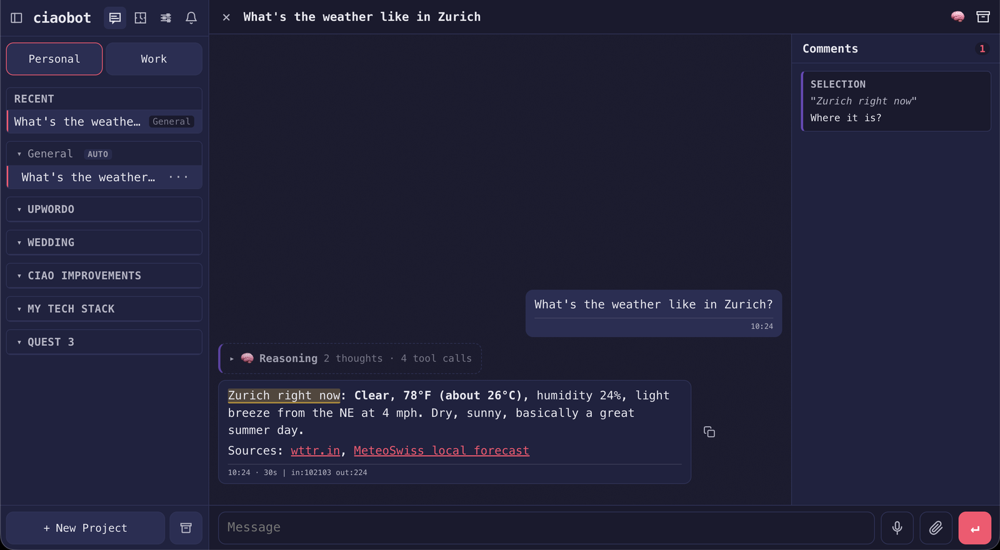
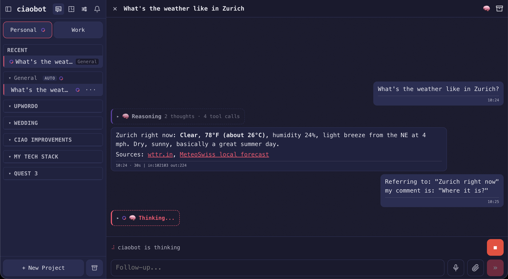

# Ciaobot

Ciaobot is an opinionated interface for using Claude Code as a personal assistant and second brain. It is a local web app around agentic work: chats, projects, files, schedules, memory, and archived knowledge all live in one interface instead of being scattered across terminal sessions.

## Install

**macOS ([Homebrew](https://brew.sh))** — recommended; includes `Ciaobot.app` and the background service:

```bash
brew install raffaelefarinaro/ciaobot/ciaobot
ciao run
```

**Any platform ([PyPI](https://pypi.org/project/ciaobot/))** — or macOS without Homebrew; requires Python 3.12 or newer (use whichever `python3.X` you have, e.g. `brew install python@3.13`):

```bash
python3.13 -m venv ~/.ciaobot-venv
~/.ciaobot-venv/bin/pip install ciaobot
~/.ciaobot-venv/bin/ciao run
```

Then open `http://localhost:8443` and follow the setup wizard. It asks for two things before creating anything:

- **Workspace folder** (default `~/ciaobot`) — one root folder holding your second brain (`memory-vault/`) plus app config and runtime state. Point it wherever you want your data to live; syncing that folder (GitHub, Drive, iCloud, …) is recommended so your vault follows you across machines. Start from scratch and it scaffolds the vault, or point it at an existing notes folder and it adapts it.
- **Model provider** — which of the supported providers to use.

The wizard then writes the config, initializes the workspace as a git repository (with a `.gitignore` that keeps `.env` and runtime state out of commits, so snapshots and sync work from day one), and on macOS installs the LaunchAgents and `Ciaobot.app`.

For scripted or headless setups, `ciao setup --workspace <dir>` skips the wizard and prints the login URL to open. If a setup link ever returns `invalid setup token` (tokens are one-time-use), print a fresh one with `~/.ciaobot-venv/bin/ciao setup-url --workspace <dir>`.

## The idea

Ciaobot does not reinvent how you talk to agents. It runs [Claude Code](https://github.com/anthropics/claude-code) in the background and focuses on what surrounds it: a decent local UI, structured workspaces, and a memory system that compounds as chats are archived.

- **Workspaces and projects** — split life areas (personal, work, a client, …) into separate workspaces, then organize work inside projects. Ciaobot injects the right files, notes, and decisions into every turn so the agent is not rediscovering context each session.
- **Learning from archived chats** — when a chat ends, Ciaobot archives the transcript, extracts session insights, and drafts memory proposals for you to review before anything lands in long-term memory.
- **An Obsidian-style vault you own** — point setup at any folder for your data (sync it via GitHub, Drive, or similar so it travels with you). Durable knowledge lives as plain markdown with wikilinks and an `INDEX.md`, inspired by [Andrej Karpathy's LLM Wiki pattern](https://gist.github.com/karpathy/442a6bf555914893e9891c11519de94f): browse it in [Obsidian](https://obsidian.md/) today, or open the same files with any agentic system tomorrow — you are not tied to Claude Code or a specific provider.
- **Skills, subagents, and commands** — packaged defaults for vault work, schedules, Google Workspace, research, and more, plus subagents and slash commands that help with day-to-day knowledge work. Extend them from the Settings UI or by adding files to the workspace; Ciaobot picks up workspace-owned skills, subagents, and commands without a rebuild.
- **Provider choice, local where it fits** — route chats through **Anthropic** (Claude subscription or API key), **Ollama** (cloud or local daemon), or **OpenRouter**, and prefer on-device models for lightweight tasks when available: chat titles via [apfel](https://github.com/Arthur-Ficial/apfel) on macOS, speech-to-text via [mlx-whisper](https://pypi.org/project/mlx-whisper/), read-aloud via Kokoro, and similar local paths elsewhere in the stack.

Pick a workspace folder, choose a provider, and work — Ciaobot is the interface on top; the vault is yours to keep.

## Why "Ciao"?

*Ciao* isn't just Italian for "hi" and "bye" — it comes from the Venetian phrase *s-ciào vostro* ("[I am] your slave"), a servile greeting that shed its literal meaning over the centuries and became the everyday word Italians use today. Fitting for an assistant: yours to command. See the [etymology on Wikipedia](https://en.wikipedia.org/wiki/Ciao#Etymology) for the full history.

## Who it's for

Ciaobot is built for **knowledge work, not software development**. It's where you brainstorm, research, draft, plan, and work through documents with an agent that already knows your context — the day-to-day thinking and writing that normally ends up scattered across chat windows, notes apps, and browser tabs.

- **Built for**: brainstorming, research, writing and editing, planning, and document work — typically drafted as plain markdown in a local vault, then published to Google (Docs, Drive, Sheets) once it's ready to leave your machine.
- **Not built for**: day-to-day coding. There is no code editor, terminal, or repo tooling in the UI — keep using your IDE for that. Ciaobot *runs on* Claude Code, but it points that engine at your knowledge and documents, not your codebase.
- **Native Google Workspace**: Gmail, Calendar, Drive, Docs, Sheets, Slides, and Tasks through Google's official [`gws` CLI](https://github.com/googleworkspace/cli), connected with browser-based OAuth from Settings — no terminal required.

## A personal project, shared

Ciaobot is my personal idea of how an AI assistant should work day to day. I built it for my own use, run it on my own machines, and the defaults reflect that: project-first navigation, a plain-markdown vault as memory, explicit model routing, and self-improvement loops that propose changes instead of applying them blindly.

I'm sharing it because the patterns may be useful to you, and because I'm happy to receive contributions: ideas, bug reports, disagreements with my defaults, and pull requests are all welcome. See [CONTRIBUTING.md](CONTRIBUTING.md).

## What it does

- Runs Claude Code-backed chats in a PWA with project and workspace navigation.
- Lets you create, preview, edit, and restore workspace files from the UI.
- Lets you schedule project or workspace routines to run when you choose.
- Archives chats into a markdown vault, then extracts session insights and drafts memory proposals for review.
- Keeps durable project context separate from short-lived chat state.
- Connects to Google Workspace — Gmail, Calendar, Drive, Docs, Sheets, Slides, and Tasks — through Google's [`gws` CLI](https://github.com/googleworkspace/cli), with browser-based OAuth from Settings (no terminal required).
- Supports voice transcription, push notifications, model/provider settings, and local package updates from the UI.
- Installs a macOS app launcher and background service so Ciaobot can start automatically after setup.

### Working in chat

- **Comment on text** — select any passage in a message, add a sidebar comment, and send it with your next prompt so the agent knows exactly what you mean.
- **Inline file previews** — when the agent reads or edits a file, a card appears in the thread; click to open a viewer with history, diff, and restore.
- **Pin documents** — keep a file open beside the chat; add line-level comments in the preview (attached to your next message, like chat comments).
- **Rich previews** — images inline; PDFs in a built-in viewer; PowerPoint (`.pptx`) converted to PDF for display (requires LibreOffice on the machine running Ciaobot).

Select text in any message to drop a comment, which collects in a side panel:





The comment travels with your next message, so the agent has the exact context:



Pin a document beside the chat and annotate it the same way:


On first launch, an in-app product tour walks through these flows. Replay it anytime from **Settings → Home → Product tour**.

What it does **not** do automatically: it never promotes memory proposals into your long-term memory files without review, never discards or rewrites an existing notes folder during onboarding, and never locks you into one provider; chats and routines can route through any configured backend.

## Providers

Use the access you already have:

- Claude Code through your Claude subscription or Anthropic API key.
- Ollama Cloud, a local Ollama daemon, or compatible Ollama model routing.
- OpenRouter through an `OPENROUTER_API_KEY`.

See [INTEGRATIONS.md](INTEGRATIONS.md) for env vars, OAuth, and per-task model routing (titles, insights, voice).

## Quickstart (from source)

A git checkout does not include the built PWA bundle, so build it once before running:

```bash
python3.12 -m venv .venv
source .venv/bin/activate
python -m pip install -e '.[test]'
(cd web && npm ci && npm run build)
ciao setup --workspace ~/ciao-workspace
ciao run
```

`ciao setup` is idempotent: it writes the initial `.env`, seeds the workspace docs and vault, and (on macOS) renders the server LaunchAgent plus a `Ciaobot.app` shortcut that opens the local PWA. Full setup details and optional Node tooling: [docs/DEVELOPMENT.md](docs/DEVELOPMENT.md).

Optional capabilities (Google Workspace, Apple Intelligence titles, MCP connectors) each have their own setup in [INTEGRATIONS.md](INTEGRATIONS.md).

## Documentation

| Doc | What's in it |
|---|---|
| [docs/ARCHITECTURE.md](docs/ARCHITECTURE.md) | System design: repo and workspace layout, chat pipeline, memory and insights, schedules, providers, frontend, device branches. |
| [docs/DEVELOPMENT.md](docs/DEVELOPMENT.md) | Setup, dev workflow, testing, change guidelines. |
| [INTEGRATIONS.md](INTEGRATIONS.md) | Operator config: env vars, OAuth, MCP connectors, server runtime knobs. |
| [PWA_API.md](PWA_API.md) | API endpoints, auth flow, state paths, agent recipes. |
| [web/README.md](web/README.md) | PWA frontend workflow, iOS Safari gotchas, design tokens. |
| [SECURITY.md](SECURITY.md) | Security policy. |
| [CONTRIBUTING.md](CONTRIBUTING.md) | How to contribute. |

Naming note: the user-facing product is **Ciaobot**. The CLI is installed as both `ciaobot` and `ciao` (same command); the Python package, import path, and many environment variables are still named `ciao`/`CIAO_*` for compatibility.

## For coding agents

`CLAUDE.md` (loaded every prompt) is the contributor guide; `docs/ARCHITECTURE.md` is the canonical orientation doc, read on demand. After changes that affect layout, capabilities, env vars, endpoints, or commands, dispatch the `doc-updater` agent to keep the docs truthful.

## Built on

Ciaobot is glue around a lot of excellent open tools. It wouldn't exist without them:

**Agent engine & models**

- [Claude Code](https://github.com/anthropics/claude-code) and the [Claude Agent SDK](https://github.com/anthropics/claude-agent-sdk-python) — the agent runtime every chat and routine runs on.
- [Ollama](https://ollama.com) — cloud and local model routing.
- [OpenRouter](https://openrouter.ai) — additional model backends via an Anthropic-compatible endpoint.
- [OpenAI](https://openai.com) — cloud voice transcription.
- [`mlx-whisper`](https://pypi.org/project/mlx-whisper/) — on-device voice transcription on Apple Silicon (free, offline).

**Integrations & CLIs**

- [Google Workspace CLI (`gws`)](https://github.com/googleworkspace/cli) — Gmail, Calendar, Drive, Docs, Sheets, Slides, and Tasks.
- [NotebookLM CLI (`notebooklm-py`)](https://pypi.org/project/notebooklm-py/) — Google NotebookLM automation.
- [`opencli`](https://www.npmjs.com/package/@jackwener/opencli) — 50+ website adapters (YouTube, LinkedIn, GitHub, …).
- [`apfel`](https://github.com/Arthur-Ficial/apfel) — local-first chat titles via macOS on-device Apple Intelligence.
- [LibreOffice](https://www.libreoffice.org) — `.pptx` slide rendering.

**Frameworks & libraries**

- [Starlette](https://www.starlette.io) + [Uvicorn](https://www.uvicorn.org) — the server.
- [Vue](https://vuejs.org), [Vite](https://vite.dev), and [Pinia](https://pinia.vuejs.org) — the PWA.
- [Excalidraw](https://excalidraw.com) — in-app diagram previews.
- [Playwright](https://playwright.dev) — headless browser automation.
