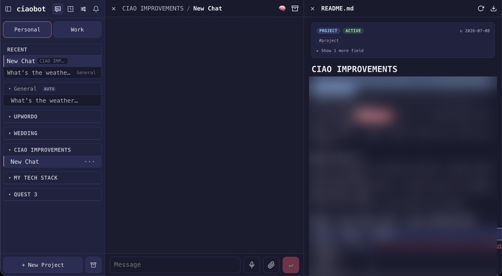

# Ciaobot

Ciaobot is a local web app for knowledge work with subscription-backed agents (Claude Code, OpenAI Codex, and others). Chats, projects, files, schedules, memory, and archived knowledge live in one interface instead of being scattered across terminal sessions — with a plain-markdown vault you own.

## Who it's for

Ciaobot is built for **knowledge work, not software development**: brainstorming, research, writing and editing, planning, and document work — typically drafted as markdown in a local vault, then published to Google (Docs, Drive, Sheets) when ready.

- **Not built for** day-to-day coding. There is no code editor or repo tooling in the UI — keep using your IDE for that.
- **Google Workspace** — Gmail, Calendar, Drive, Docs, Sheets, Slides, and Tasks through Google's [`gws` CLI](https://github.com/googleworkspace/cli), connected with browser-based OAuth from Settings.

## The idea

Ciaobot does not reinvent how you talk to agents. It runs [Claude Code](https://github.com/anthropics/claude-code) or [OpenAI Codex](https://developers.openai.com/codex/cli/) in the background and focuses on what surrounds them: a local UI, structured workspaces, and memory that compounds as chats are archived.

- **Workspaces and projects** — split life areas (personal, work, a client, …) into sidebar workspaces, then organize work inside projects. Ciaobot injects project notes and context into every turn.
- **A vault you own** — durable knowledge as plain markdown with wikilinks and an `INDEX.md`, inspired by [Andrej Karpathy's LLM Wiki pattern](https://gist.github.com/karpathy/442a6bf555914893e9891c11519de94f). Browse in [Obsidian](https://obsidian.md/) or any editor; sync via GitHub, Drive, or iCloud.
- **Skills, subagents, and commands** — packaged defaults, extensible from Settings or workspace files (see [What ships by default](#what-ships-by-default)).
- **Files and automations** — create, preview, edit, and restore vault files from the UI; run recurring routines on a cron you choose (schedules) or re-run a prompt inside one chat every N minutes (loops).
- **Voice, notifications, and updates** — transcription, push alerts, model settings, and in-app package updates. On macOS: menu bar companion, `Ciaobot.app`, and background service after setup.
- **Provider choice** — Claude Code or Codex with your existing login; Ollama, OpenRouter, and on-device models for lighter tasks (see [Providers](#providers)).

Pick a workspace folder, choose a provider, and work — Ciaobot is the interface on top; the vault is yours to keep.

## Memory and the vault

Ciaobot keeps memory in layers so the agent can recall what matters without stuffing every prompt. **Settings → Context** shows what the agent actually loads.

- **Short agent memory** (`~/.ciao/memory.md` and `user.md`) — a small, capped scratchpad the model maintains for you: preferences, conventions, lessons. Updated during conversation or via `/remember`; a snapshot is injected at the start of each chat.
- **Your vault** (`memory-vault/`, or a separate vault root per sidebar workspace) — durable markdown you own: people, projects, ideas. Browse it in Obsidian or any editor; it stays useful even without Ciaobot.
- **One behavior file for the install** — `<workspace>/CLAUDE.md` (and `AGENTS.md` for Codex) applies to every chat.

When your message mentions a name that appears in the vault index, the agent gets a quiet hint — “this probably means `People/Emma`” — so it opens the right note without you repeating context. And when a chat is archived, a pipeline turns it into durable knowledge: session insights are extracted, memory proposals are drafted, and daily/weekly curation runs update vault pages — but nothing is promoted into long-term memory without review, and Ciaobot never discards or rewrites an existing notes folder during onboarding. Track the background steps under **Settings → Automation**, and see [docs/ARCHITECTURE.md](docs/ARCHITECTURE.md) for the full pipeline.

## Working in chat

- **Comment on text** — select any passage in a message, add a sidebar comment, and send it with your next prompt so the agent knows exactly what you mean.
- **Inline file previews** — when the agent reads or edits a file, a card appears in the thread; click to open a viewer with history, diff, and restore.
- **Pin documents** — keep a file open beside the chat; add line-level comments in the preview (attached to your next message, like chat comments).
- **Rich previews** — images inline; PDFs in a built-in viewer; PowerPoint (`.pptx`) converted to PDF for display (requires LibreOffice on the machine running Ciaobot).



On first launch, an in-app product tour walks through these flows. Replay it anytime from **Settings → Home → Product tour**.

## What ships by default

Every install seeds a set of subagents, slash commands, and system routines from the package (`ciao/stock/`); your own workspace versions with the same name take precedence.

### Subagents

Specialized roles the main agent can delegate to ([ciao/stock/agents/](ciao/stock/agents/)):

| Subagent | What it does |
|---|---|
| [memory](ciao/stock/agents/memory.md) | Vault curation, durable note updates, and memory-proposal processing. |
| [researcher](ciao/stock/agents/researcher.md) | Researches current external information and summarizes it with sources. |
| [secretary](ciao/stock/agents/secretary.md) | Calendar, email, reminders, and lightweight admin via the Google Workspace skills; asks before sending anything. |

### Slash commands

Type these in any chat ([ciao/stock/commands/](ciao/stock/commands/)):

| Command | What it does |
|---|---|
| [/remember](ciao/stock/commands/remember.md) | Saves a durable fact or learning to the right memory layer (agent memory, user profile, or a vault page). |
| [/interrogation](ciao/stock/commands/interrogation.md) | Asks a few targeted questions to turn a vague project, person, or idea into a useful canonical vault note. |
| [/critique](ciao/stock/commands/critique.md) | Quick single-model review of a plan or draft (the multi-model `adversarial-review` skill is the heavier option). |

### System routines

Recurring schedules that ship enabled ([ciao/stock/schedules.json](ciao/stock/schedules.json)); they run through the same provider pipeline as a chat turn, and their runs are visible under **Settings → Automation**:

| Routine | Cadence | What it does |
|---|---|---|
| Memory curation | Daily | Reviews recent archived chats, memory proposals, and learnings; updates vault pages and `Workspace/Learnings.md`. |
| Skill evolution | Weekly (Sun) | Drafts skill-improvement proposals from recent usage; never applies them automatically. |
| Weekly self-improvement review | Weekly (Sun) | Runs the [weekly review checklist](ciao/stock/schedules/weekly-review-template.md): promote recurring learnings, lint the vault, reconcile contradictions. |

Your own schedules live alongside these in the workspace (`.runtime/schedules.json`), with in-chat loops in `.runtime/loops.json`; both are managed from the UI's Automations page. Packaged **skills** (vault search, Google Workspace, web research, and more) are browsable under **Settings → Skills** and live in [ciao/stock/skills/](ciao/stock/skills/).

## Install

**macOS ([Homebrew](https://brew.sh))** — recommended; includes `Ciaobot.app` and the background service:

```bash
brew install raffaelefarinaro/ciaobot/ciaobot
ciao run
```

**Any platform ([PyPI](https://pypi.org/project/ciaobot/))** — or macOS without Homebrew; requires Python 3.12 or newer:

```bash
python3.13 -m venv ~/.ciaobot-venv
~/.ciaobot-venv/bin/pip install ciaobot
~/.ciaobot-venv/bin/ciao run
```

Then open `http://localhost:8443` and follow the setup wizard:

- **Workspace folder** (default `~/ciaobot`) — your second brain (`memory-vault/`) plus app config and runtime state. Sync this folder (GitHub, Drive, iCloud, …) so your vault follows you across machines.
- **Model provider** — Claude Code, Codex, or another configured backend.

The wizard writes config, initializes the workspace as a git repo (with a `.gitignore` for secrets and runtime state), and on macOS installs LaunchAgents and `Ciaobot.app`.

For scripted setups: `ciao setup --workspace <dir>`. If a setup link returns `invalid setup token`, mint a fresh one with `ciao setup-url --workspace <dir>`.

Contributors running from a git checkout: see [docs/DEVELOPMENT.md](docs/DEVELOPMENT.md).

## Providers

Use the access you already have:

- **Claude Code** — CLI-managed Claude subscription or Anthropic Console authentication.
- **OpenAI Codex** — `codex login`, including eligible ChatGPT subscription accounts.
- **Ollama** — cloud or local daemon.
- **OpenRouter** — `OPENROUTER_API_KEY`.
- **On-device models** — for lightweight tasks where available: titles via [apfel](https://github.com/Arthur-Ficial/apfel), speech via [mlx-whisper](https://pypi.org/project/mlx-whisper/), and similar.

See [INTEGRATIONS.md](INTEGRATIONS.md) for env vars, OAuth, and per-task model routing (titles, insights, voice).

## A personal project, shared

Ciaobot is my personal idea of how an AI assistant should work day to day. I built it for my own use, run it on my own machines, and the defaults reflect that: project-first navigation, a plain-markdown vault as memory, explicit model routing, and self-improvement loops that propose changes instead of applying them blindly.

I'm sharing it because the patterns may be useful to you. Ideas, bug reports, disagreements with my defaults, and pull requests are welcome — see [CONTRIBUTING.md](CONTRIBUTING.md).

## Documentation

| Doc | What's in it |
|---|---|
| [docs/ARCHITECTURE.md](docs/ARCHITECTURE.md) | System design: repo and workspace layout, chat pipeline, memory, schedules, providers. |
| [docs/DEVELOPMENT.md](docs/DEVELOPMENT.md) | Git checkout, dev workflow, testing, change guidelines. |
| [INTEGRATIONS.md](INTEGRATIONS.md) | Env vars, OAuth, MCP connectors, server runtime knobs. |
| [PWA_API.md](PWA_API.md) | API endpoints, auth flow, state paths, agent recipes. |
| [web/README.md](web/README.md) | PWA frontend workflow, iOS Safari gotchas, design tokens. |
| [SECURITY.md](SECURITY.md) | Security policy. |
| [CONTRIBUTING.md](CONTRIBUTING.md) | How to contribute. |
| [docs/CREDITS.md](docs/CREDITS.md) | Open tools Ciaobot is built on. |

Naming note: the user-facing product is **Ciaobot**. The CLI is installed as both `ciaobot` and `ciao` (same command); the Python package, import path, and many environment variables are still named `ciao`/`CIAO_*` for compatibility.

## Why "Ciao"?

*Ciao* isn't just Italian for "hi" and "bye" — it comes from the Venetian phrase *s-ciào vostro* ("[I am] your slave"), a servile greeting that shed its literal meaning over the centuries and became the everyday word Italians use today. Fitting for an assistant: yours to command. See the [etymology on Wikipedia](https://en.wikipedia.org/wiki/Ciao#Etymology).

## Built on

Ciaobot is glue around a lot of excellent open tools — Claude Code, the Claude Agent SDK, Codex CLI, Starlette, Vue, and more. See [docs/CREDITS.md](docs/CREDITS.md) for the full list.
