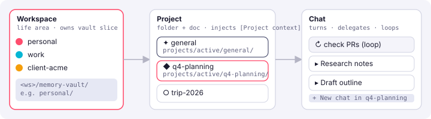
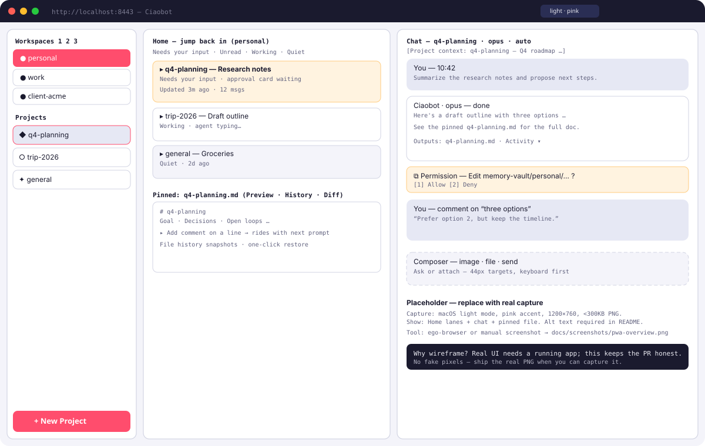
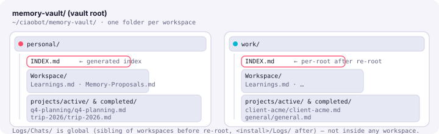
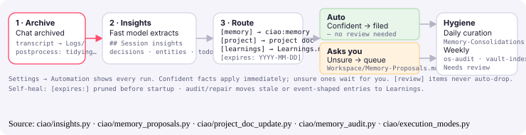

# Ciaobot

<p align="center">
  
</p>

Ciaobot is a **second brain you own** — a local, provider-agnostic AI workspace whose memory is a plain-markdown vault you own outright. Chats, projects, files, schedules, and memory live in one interface, backed by whichever model you choose (Claude Code, opencode, and others).

## 30-second mental model

**Workspace → Project → Chat.** That's the whole app.

- **Workspace** — a life area (personal, work, a client). It owns a vault slice (`memory-vault/<workspace>/`), its own projects, and its default model. Switch workspaces in the sidebar — the Home lanes swap with it.
- **Project** — a folder + doc (`projects/active/<name>/<name>.md`). Its frontmatter `description:` is injected as `[Project context: …]` into every turn, and the doc's body stays out of the prompt until the agent opens it.
- **Chat** — turns, tool calls, and file touches in one project. Fork it, delegate parallel subchats to it, or loop a prompt inside it.



> **PWA preview:** Home lanes + chat with a pinned doc. Wireframe placeholder until a real light-mode capture lands at `docs/screenshots/pwa-overview.png` (see `docs/screenshots/pwa-overview.svg`).
>
> 

## Install

**macOS 13+ on Apple Silicon (M1 or newer)** — the supported end-user installation is:

```bash
curl -fsSL https://github.com/raffaelefarinaro/ciaobot/releases/latest/download/install.sh | sh
```

The installer is per-user: it puts a self-contained `Ciaobot.app` in `~/Applications`, preserves an existing configured workspace, and starts the tray app through its per-user `Ciaobot` LaunchAgent. On a clean machine it starts bootstrap mode instead, so the first-run onboarding asks where to create or adopt a workspace and which password to set; it never hides a generated password in a new directory. It bundles Ciaobot's Python runtime and dependencies, so Python, `pip`, Homebrew, `sudo`, and a separate DMG are not required.

The installer verifies the signed release archive before extracting it. Ciaobot is currently ad-hoc signed and not notarized, so macOS may still show a Gatekeeper warning when the app is first opened.

Updates normally come from the app's **Update…** action, which replaces the app and bundled engine together. Re-running the installer is also supported for recovery or a pinned version:

```bash
curl -fsSL https://github.com/raffaelefarinaro/ciaobot/releases/latest/download/install.sh \
  | sh -s -- --version 0.8.0
```

For security-conscious users, download `install.sh` first, inspect it, and run it locally instead of piping it directly to `sh`.

Then open `http://localhost:8443` and follow the setup wizard:

- **Workspace folder** (default `~/ciaobot`) — your second brain (`memory-vault/`) plus app config and runtime state. Sync this folder (GitHub, Drive, iCloud, …) so your vault follows you across machines.
- **Dashboard password** — Ciaobot is password-protected by default: this is what you type to open it, and what another device needs to connect as a client. Change it later in Settings → PWA password.
- **Model provider** — Claude Code, opencode, or another configured backend.

The wizard writes config, initializes the workspace as a git repo (with a `.gitignore` for secrets and runtime state), and keeps the bundled engine LaunchAgent in sync.

For scripted setups: `ciao setup --workspace <dir> --auth-token <password>` (a random password is generated into `.env` when omitted; `--no-auth` opts out of protection entirely). If a setup link returns `invalid setup token`, mint a fresh one with `ciao setup-url --workspace <dir>`.

Contributors running from a git checkout: see [docs/DEVELOPMENT.md](docs/DEVELOPMENT.md).

## Workspaces & Projects — how to use

Pick a workspace in the sidebar, then work inside projects. Each workspace keeps its own notes, so `personal` never pollutes `work`.

1. **Pick or create a workspace** in the sidebar (personal, work, a client …). Each one gets a colour dot and owns `memory-vault/<workspace>/`.
2. **New Project** → name it (`q4-planning`). That creates `memory-vault/<workspace>/projects/active/<name>/<name>.md` with frontmatter `name:` / `description:`.
3. **Chat** inside that project — mention a name the vault knows and the agent is quietly pointed at the right note; pin a doc beside the chat and comment on any passage (it rides with your next prompt).
4. **Archive** the chat when done → Session insights are extracted and a follow-up queue is filed.
5. **Review proposals** under Memory → clear the queue, or let the daily/weekly curation do its pass (see [Memory that compounds (and asks)](#memory-that-compounds-and-asks)).

A project completes with the PWA's **Complete** button (`projects/completed/<name>/`); restore it from the archive icon next to "+ New Project". Every workspace has an auto-created **General** project for ad-hoc chats. See [docs/ARCHITECTURE.md](docs/ARCHITECTURE.md) for the full naming rules and frontmatter contract.



Paths shown are `memory-vault/<workspace>/projects/active/<name>/`, `Workspace/Learnings.md`, and `INDEX.md` per workspace. `Logs/Chats/` stays global (a sibling of the workspaces). After the per-workspace re-rooting it promotes to `<install>/Logs/` without moving files.

## Memory that compounds (and asks)

Ciaobot keeps memory in layers so the agent recalls what matters without stuffing every prompt. **Settings → Context** shows what actually loads.

- **Short agent memory** (fenced `ciao:memory` / `ciao:profile` in workspace `CLAUDE.md`) — a small, capped scratchpad: preferences, conventions, lessons, profile. Add `[expires: YYYY-MM-DD]` to a temporary entry; it is hidden after that date and removed on the next daily curation pass.
- **Your vault** (`memory-vault/`, or one vault slice per workspace) — durable markdown you own. Browse in Obsidian or any editor; sync via GitHub/Drive/iCloud. A generated `INDEX.md` + `VOCABULARY.md` and the Memory Map graph come from `ciao vault-index`.
- **One behavior file for the install** — `<workspace>/CLAUDE.md`, linked as `AGENTS.md` for shared runtime discovery.

When a chat is archived, `ciao/insights.py` extracts `## Session insights`, then `ciao/memory_proposals.py` routes each fact to its destination and `ciao/project_doc_update.py` folds decisions into the canonical project doc. Track the background steps under **Settings → Automation**.

| Auto — filed right away | Asks you — queued for review |
|---|---|
| Confident facts → written to their destination (bounded regions, project doc, people notes, `Workspace/Learnings.md`). | Unsure facts → `Workspace/Memory-Proposals.md` — one bullet per fact, with `[memory]` / `[project]` / `[rehome]` kind. |
| `[expires: YYYY-MM-DD]` entries past their date are pruned before the next provider turn and removed during daily curation. | Aging notes → **Needs review** (Memory Map sidebar, `ciao memory-audit`). Project 30d / person 90d / other 180d staleness horizons; `updated:` frontmatter or mtime. |
| Daily curation (still under review): consolidates duplicates/superseded entries at ~85% cap, copies every removal to `Workspace/Memory-Consolidations.md` for undo, and never drops a fact just to fit a cap. | Weekly hygiene: `ciao vault-index --write` + `ciao os-audit --json`. A `[review]` queue entry stays until you act — dismiss keeps it, dropping it takes an attended edit. |



Self-heal without silent edits: `ciao memory-audit` flags event-shaped or stale-path entries in the always-loaded regions and moves them to `Workspace/Learnings.md`; `os-audit` can repair low-risk link/index drift and then reports what still needs attention. See [docs/ARCHITECTURE.md](docs/ARCHITECTURE.md) for the full pipeline and the consolidation guardrails.

## What we change from stock Claude Code

Stock Claude Code ships skills and tools for scheduling, diagnostics, and settings that clash with the PWA. Ciaobot hides the ones the PWA already owns and keeps everything you added.

- We turn off the **cloud routines** skill (`schedule` — CronCreate/CronDelete/CronList) and the **interval loop** skill (`loop` — ScheduleWakeup) — the PWA's **Automations** page owns schedules (`ciao/schedules.py`) and loops (`ciao/loops.py`) instead.
- We turn off the **settings/diagnostics** skills (`update-config`, `fewer-permission-prompts`, `doctor`) — **Settings** in the PWA is the surface for models, auth, and health (`ciao os-audit`).
- We turn off the **design-system sync** skill (`design-sync`) — the PWA has its own `DESIGN.md` tokens; the upstream DesignSync tool is denied.
- We turn off the **bundled run stubs** (`run`, `run-skill-generator`) — Ciaobot uses per-project `.claude/skills/` equivalents instead.
- We turn off the **dataviz** bundled skill — Ciaobot ships its own `.claude/skills/dataviz/` for HTML artifacts.
- In the tool layer we also deny **plan-mode, notebook, push-notification, and routine-trigger** tools (`EnterPlanMode`/`ExitPlanMode`, `NotebookEdit`, `PushNotification`, `RemoteTrigger`) — the PWA controls notifications, plan approval, and scheduling.

Workspace skills, subagents, and slash commands are untouched — a same-named workspace skill still overrides a stock one. The full lists and how to probe them live in [docs/ARCHITECTURE.md](docs/ARCHITECTURE.md) (`ciao/execution_modes.py:24`, `ciao/config.py:30`, `ciao/providers/claude.py:536`).

## Why it exists

Ciaobot started from the limits of Claude Cowork. Cowork is genuinely good at *doing the work* — it runs on your own desktop, edits your own files, and follows along on your phone. But it's Claude-only, and everything it learns about *you* — your sessions, your context, your history — lives in an account you rent. It knows you no better on day 365 than on day 1.

Ciaobot is the other bet — differences that are structural, not features:

- **Any model, local or cloud.** Claude Code for Anthropic and opencode for everything else — including models running on your own hardware. The second brain outlives any single model.
- **Your machine's own power.** Voice is already wired to work on-device: dictation and read-aloud run on your computer (Apple Silicon) with no cloud round-trip needed.
- **Accrual, not storage.** A memory system, baked in, that curates itself and compounds into *you* over time — not a pile of past sessions.
- **Yours to keep.** That memory is plain markdown in a git repo you own outright — portable, and useful even if this app disappears.

The coworker is just the interface. The second brain is the product.

## It follows you — without leaving your machine

Ciaobot runs on your computer, but you're not chained to your desk. The PWA is built mobile-first with push notifications, and over [Tailscale](https://tailscale.com/) your phone reaches the machine at home on a private mesh — the same desk-to-phone continuity as a cloud assistant, without shipping your work to anyone's servers. The one honest trade: the host has to be awake. When the machine sleeps, so does your second brain.

## Who it's for

Ciaobot is built for **knowledge work, not software development**: brainstorming, research, writing and editing, planning, and document work — typically drafted as markdown in a local vault, then published to Google (Docs, Drive, Sheets) when ready.

- **Not built for** day-to-day coding. There is no code editor or repo tooling in the UI — keep using your IDE for that.
- **Google Workspace** — Gmail, Calendar, Drive, Docs, Sheets, Slides, and Tasks through Google's [`gws` CLI](https://github.com/googleworkspace/cli), connected with browser-based OAuth from Settings.

## The idea

Ciaobot does not reinvent how you talk to agents. It runs [Claude Code](https://github.com/anthropics/claude-code) or [opencode](https://opencode.ai) in the background, on the bet that the vendors' own CLIs are the best-maintained agent harnesses available — they keep the model communication, tool use, and agentic loop optimized so this project doesn't have to. Ciaobot stays in control of the three things that matter:

1. **The context** — deciding exactly what memory, notes, and project state the agent is fed each turn.
2. **One interface** — the same UI regardless of which project or provider you're talking to.
3. **Incremental capabilities** — features are added only when needed or when a pattern is worth adopting, not speculatively.

Rather than build and run servers, Ciaobot stands on primitives that already have millions of users hardening them — **git** for sync, versioning, and durability; **Tailscale** for private remote access; and one **PWA** shared by browsers, phones, and the thin macOS shell. Also see [What we change from stock Claude Code](#what-we-change-from-stock-claude-code) and the authenticated chat-scoped MCP surface in [docs/MCP.md](docs/MCP.md) (`ciao/mcp_server.py`).

Pick a workspace folder, choose a provider, and work — Ciaobot is the interface on top; the vault is yours to keep.

## Features

**Chats, projects, and workspaces**

- Sidebar workspaces per life area (personal, work, a client) — each with its own vault, projects, and default model.
- Projects group related chats and inject durable notes and context into every turn.
- Comment on any passage of a reply — select text, attach a note (typed or dictated), and it rides along with your next prompt; queue follow-ups while the agent is still working.
- Per-chat model picker with provider thinking levels on top of per-workspace defaults.
- Fork conversation: create a new independent chat in the same project starting from any completed agent answer, preserving history.
- Delegates: a chat's agent spawns writable delegate chats (own model, own session, full tool access) to work in parallel; capped at 6 per chat, no nesting.

**Files, documents, and voice**

- Completed turns surface touched files as `Outputs` chips below the final reply; expand `Activity` for notes, tool calls, and file cards. Click a file for history, diff, and restore.
- Pin a document beside the chat and add line-level comments on the preview (typed or dictated, attached to your next message).
- Rich previews: images inline, PDFs in a built-in viewer, PowerPoint (`.pptx`) via LibreOffice-to-PDF, and self-contained HTML artifacts (sandboxed frame, no network, `data:` media only).
- Create, edit, and restore vault files from the UI, with snapshots behind every agent edit.
- Voice: on-device dictation (macOS 26+) and read-aloud (system Premium voices via `ciaobot-native` sidecar). No cloud voice or model download.

**Memory, vault, and insight extraction**

- Layered memory: capped agent memory + user profile injected at chat start, plus a plain-markdown vault (Obsidian-compatible, syncable via GitHub/Drive/iCloud).
- Archiving a chat runs an extraction pipeline: insights and trajectories captured, each fact routed to bounded regions, the project's canonical doc, people notes, or `Workspace/Learnings.md` — confident facts auto-applied, unsure ones queued.
- Daily and weekly curation keep vault pages and `Workspace/Learnings.md` current.
- Vault-index hints: mention a name the index knows and the agent is pointed at the right note.

**Automations**

- Schedules: recurring or one-off cron routines that dispatch fresh prompts into a project or chat (with a durable `schedule_id` backlink so banners survive later runs).
- Loops: re-run a prompt inside one chat every N minutes, keeping context between iterations. Marked `↻` in the sidebar; PWA owns them — the harness's own `/schedule` and `/loop` skills are removed and denied so automations land in Ciaobot instead of a cloud routine it cannot see.
- System routines ship enabled (memory curation, workspace hygiene, skill evolution); every run is visible under **Settings → Automation**.

**Extensibility — skills, subagents, commands**

- Stock skills, subagents, and slash commands ship with the app; same-named workspace versions override them.
- Install skills from GitHub repositories; they refresh automatically on restart.
- Run declarative live evaluations for one skill or subagent through an isolated full chat, with deterministic output and tool assertions.
- A weekly skill-evolution routine proposes improvements from real usage — reviewable proposals, never silent edits.

**Providers, Google Workspace, and app surface**

- Claude Code or opencode with the login you already have — plus Ollama/OpenRouter/any OpenAI-compatible endpoint via opencode, and on-device models for lighter tasks (see [Providers](#providers)).
- Gmail, Calendar, Drive, Docs, Sheets, Slides, and Tasks through Google's `gws` CLI, connected with browser OAuth from Settings.
- Installable PWA with web-push notifications and in-app app updates; macOS desktop app with one Dock window, menu-bar companion, native notifications, updates, and a launchd-managed engine.

## What ships by default

Every install seeds a set of subagents, slash commands, and system routines from the package (`ciao/stock/`); your own workspace versions with the same name take precedence.

### Subagents

Specialized roles the main agent can delegate to ([ciao/stock/agents/](ciao/stock/agents/)):

| Subagent | What it does |
|---|---|
| [memory](ciao/stock/agents/memory.md) | Vault curation, durable note updates, and memory-proposal processing. |
| [researcher](ciao/stock/agents/researcher.md) | Researches current external information and summarizes it with sources. |
| [secretary](ciao/stock/agents/secretary.md) | Calendar, email, reminders, and lightweight admin via the Google Workspace skills; asks before sending anything. |

### Slash commands

Type these in any chat; they ship in [ciao/stock/commands/](ciao/stock/commands/):

| Command | What it does |
|---|---|
| [/remember](ciao/stock/commands/remember.md) | Saves a durable fact or learning to the right memory layer (agent memory, user profile, or a vault page). |
| [/interrogation](ciao/stock/commands/interrogation.md) | Asks a few targeted questions to turn a vague project, person, or idea into a useful canonical vault note. |
| [/critique](ciao/stock/commands/critique.md) | Multi-model adversarial review of a plan or draft, via the `adversarial_review` MCP tool. |

### System routines

Recurring schedules that ship enabled ([ciao/stock/schedules.json](ciao/stock/schedules.json)); they run through the same provider pipeline as a chat turn, and their runs are visible under **Settings → Automation**:

| Routine | Cadence | What it does |
|---|---|---|
| Memory curation | Daily | Processes uncertain or failed memory items left after archive-time auto-filing, re-checks aging vault notes, and updates vault pages and `Workspace/Learnings.md`. Removes `[expires:]` entries after their date and reports malformed tags. Then runs `ciao memory-audit --json` and repairs rot in the always-loaded regions: event-shaped entries move to `Workspace/Learnings.md`, broken paths are corrected/dropped, competing values collapsed. |
| Workspace hygiene | Weekly (Sun) | Regenerates the vault index with `ciao vault-index --write`, then runs `ciao os-audit --json`. Repairs low-risk link/index drift, then verifies the rest. |
| Skill evolution | Weekly (Sun) | Drafts skill-improvement proposals from recent usage; never applies them automatically. |

Your own schedules live alongside these in the workspace (`.runtime/schedules.json`), with in-chat loops in `.runtime/loops.json`; both are managed from the UI's Automations page. Packaged **skills** (Google Workspace, web research, and more) are browsable under **Settings → Assets** and live in [ciao/stock/skills/](ciao/stock/skills/).

## Providers

Use the access you already have:

- **Claude Code** — CLI-managed Claude subscription or Anthropic Console authentication.
- **opencode** — the open-source agent CLI, bring-your-own model provider (`opencode auth login` or the config you already have). This is the path to everything Anthropic and OpenAI do not serve: Ollama, OpenRouter, or any OpenAI-compatible endpoint. Configure it in opencode and its models appear in Ciaobot's pickers automatically — Ciaobot reads whatever opencode reports as connected.
- **On-device models** — for lightweight tasks where available: chat titles via Apple's on-device Foundation Model, dictation and read-aloud via the built-in macOS speech frameworks. All of it ships with macOS; none of it needs installing.

See [INTEGRATIONS.md](INTEGRATIONS.md) for env vars, OAuth, and per-task model routing (titles, insights, voice).

## A personal project, shared

Ciaobot is my idea of an AI assistant that belongs to you, not to a vendor: it runs on your machine, talks to whichever model you choose, and turns your work into a second brain you keep in plain files. I built it for my own use and run it on my own machines; the defaults reflect that: project-first navigation, a plain-markdown vault as memory, explicit model routing, and self-improvement loops that propose changes instead of applying them blindly.

I'm sharing it because the patterns may be useful to you. Ideas, bug reports, disagreements with my defaults, and pull requests (`#agentswelcome`) are welcome — see [CONTRIBUTING.md](CONTRIBUTING.md).

## Documentation

| Doc | What's in it |
|---|---|
| [docs/ARCHITECTURE.md](docs/ARCHITECTURE.md) | System design: repo and workspace layout, chat pipeline, memory, schedules, providers. |
| [docs/MCP.md](docs/MCP.md) | Embedded MCP architecture, security, complete tool catalog, and provider process configuration. |
| [docs/DEVELOPMENT.md](docs/DEVELOPMENT.md) | Git checkout, dev workflow, testing, change guidelines. |
| [INTEGRATIONS.md](INTEGRATIONS.md) | Env vars, OAuth, MCP connectors, server runtime knobs. |
| [PWA_API.md](PWA_API.md) | API endpoints, auth flow, state paths, agent recipes. |
| [web/README.md](web/README.md) | PWA frontend workflow, iOS Safari gotchas, design tokens. |
| [SECURITY.md](SECURITY.md) | Security policy. |
| [CONTRIBUTING.md](CONTRIBUTING.md) | How to contribute. |
| [docs/CREDITS.md](docs/CREDITS.md) | Open tools Ciaobot is built on. |

Naming note: the user-facing product is **Ciaobot**. The CLI is installed as both `ciaobot` and `ciao` (same command); the Python package, import path, and many environment variables are still named `ciao`/`CIAO_*` for compatibility.

## Why "Ciao"?

*Ciao* isn't just Italian for "hi" and "bye" — it comes from the Venetian phrase *s-ciào vostro* ("[I am] your slave"), a servile greeting that shed its literal meaning over the centuries and became the everyday word Italians use today. Fitting for an assistant: yours to command. See the [etymology on Wikipedia](https://en.wikipedia.org/wiki/Ciao#Etymology).

## Built on

Ciaobot is glue around a lot of excellent open tools — Claude Code, the Claude Agent SDK, opencode, Starlette, Vue, and more. See [docs/CREDITS.md](docs/CREDITS.md) for the full list.
