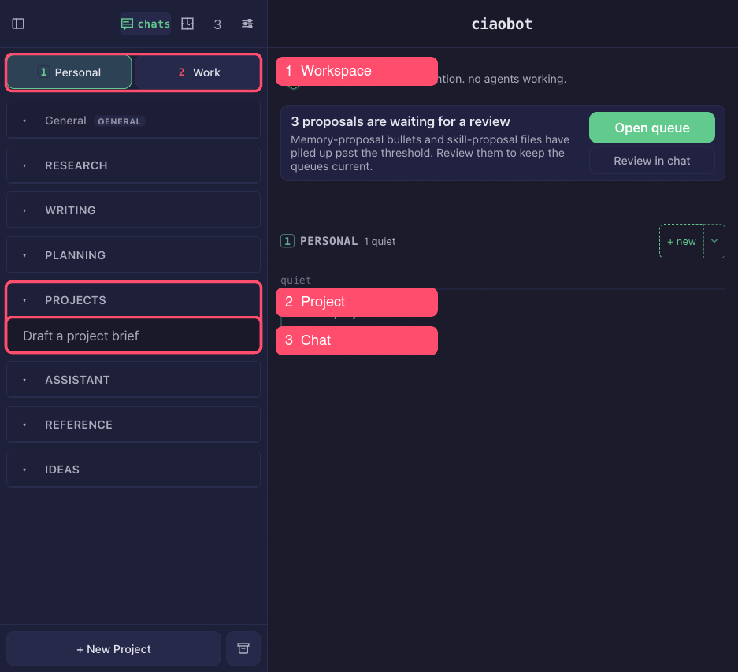

# Ciaobot

<p align="center">
  
</p>

Ciaobot is your **second brain and personal assistant**. It is built on top of the CLIs you already use, such as [Claude Code](https://github.com/anthropics/claude-code) and [opencode](https://opencode.ai), and gives you one interface for working with them.

You are not tied to one CLI, model, or provider. Use Claude, opencode with a cloud or local model, or switch between them as needed. Ciaobot keeps the interface and the context consistent while your work, chats, and memory remain in a folder you own and can reuse with any CLI in the future.

## Install

**macOS 13+ on Apple Silicon (M1 or newer):**

```bash
curl -fsSL https://github.com/raffaelefarinaro/ciaobot/releases/latest/download/install.sh | sh
```

Open `http://localhost:8443` and follow the setup wizard. It will help you choose or create your workspace, set a dashboard password, and connect the provider you want to use.

During setup, choose the folder where Ciaobot should work. It can be a new folder or an existing one with notes and memories. Ciaobot creates or adopts the vault there and can help migrate existing memories when needed. The folder remains yours: you can keep it under version control, open it in Obsidian or a text editor, and reuse it with Claude Code, opencode, or another CLI.

### Connect your agent

Ciaobot does not replace the agent CLI or ask you to create a second model account. It runs the CLI you have already authenticated:

- **Anthropic / Claude:** install [Claude Code](https://docs.anthropic.com/en/docs/claude-code/overview) (`curl -fsSL https://claude.ai/install.sh | bash`; it lands in `~/.local/bin`, so add that to your `PATH` if `claude` is not found afterwards), sign in with `claude auth login`, then choose **Claude Code** in Ciaobot. Ciaobot uses that official Claude Code session, adds the relevant workspace and project context, and handles chat archiving, memory extraction, and proposal review around it.
- **OpenAI, OpenRouter, Ollama, and other providers:** install [opencode](https://opencode.ai/docs/), then configure and authenticate the provider in opencode. Choose **opencode** in Ciaobot; its connected models appear in Ciaobot's model picker. This also includes local models running on your own machine.

Ciaobot keeps provider credentials in the provider's own CLI. It supplies the interface, workspace context, files, projects, scheduling, and second-brain memory around the agent. See [INTEGRATIONS.md](INTEGRATIONS.md) for current installation and authentication commands.

Contributors running from a git checkout can follow [docs/DEVELOPMENT.md](docs/DEVELOPMENT.md).

## How it works

The basic model is **workspace → project → chat**:

- A **workspace** is a named area such as personal, work, or a client inside the folder you selected during setup. Each workspace has its own projects and memory, so a "personal" workspace never pollutes a "work" workspace.
- A **project** groups related work. Its frontmatter `description:` is included as project context in every turn, so you do not need to explain to the model which project you are working in every time.
- A **chat** is where the work happens. When you finish, archive it and Ciaobot extracts useful insights and routes them into your memory or project documents.

You can do everything from a chat. Ask Ciaobot to create a project, move a chat into a project, archive a conversation, find a file, update your memory, or set up a recurring prompt. The interface is there to make those CLI-powered workflows easy to use and keep their context together.



The screenshot shows the selected **workspace** at the top of the sidebar, the **Projects** area below it, and a **chat** inside that project.

## Your second brain

Memory is stored as ordinary Markdown in your workspace. You can read it in Ciaobot, Obsidian, a text editor, Claude Code, opencode, or any other tool that works with files.

When you archive a conversation, Ciaobot extracts decisions, useful learnings, and other durable facts. Confident facts are filed automatically; uncertain ones become proposals for you to review. This lets your second brain grow from the work you actually do without making the vault a proprietary database.

If you want to understand the extraction and memory pipeline in detail, point your agent to [`docs/MEMORY_DESIGN.md`](https://github.com/raffaelefarinaro/ciaobot/blob/main/docs/MEMORY_DESIGN.md) and ask it to explain the relevant parts.

## Features

- **Workspaces and projects:** Keep personal, work, and client contexts separate; group chats around projects; switch context from the sidebar.
- **Chats and agents:** Continue conversations, fork them, run prompts on a schedule, and follow the subagents working in the background.
- **Files and documents:** Work with the model and a document side by side. Open Markdown files natively, edit them, pin them beside the chat, and add precise comments about what to change and where before sending the instructions back to the model. CSV files open as editable tables, and PowerPoint files are shown as PDFs. Supported document attachments are converted to Markdown with AnyDoc so the model can read them quickly.
- **Memory and archiving:** Every archived chat goes through memory extraction. Once a day, Ciaobot consolidates what was learned or asks you to review it before it becomes durable. The second-brain UI shows your notes and their connections so you can explore, adjust, and discuss them with the model.
- **Adversarial review:** Send the same file, question, or idea to a panel of multiple configured agents and models, then compare their independent feedback and receive a synthesized verdict that helps select the strongest answer.
- **Automations:** Run recurring or one-off prompts and see their status in Settings.
- **Providers:** Use Claude Code or opencode with the model access you already have, including local models exposed through opencode.
- **Google Workspace:** Use the native integration with Google's [`gws` CLI](https://github.com/googleworkspace/cli) to connect and set up your Google account from Ciaobot, then work with Gmail, Calendar, Drive, Docs, Sheets, Slides, Forms, and Tasks.
- **Workspace extensions:** Add and manage skills, MCP servers, slash commands, and subagents per workspace through the UI, without manually editing configuration files.
- **Host and client access:** Run Ciaobot on a main machine that owns the engine, workspace, and vault, then connect to it from another computer, phone, or tablet as a client. Use the PWA over a private network such as [Tailscale](https://tailscale.com/) while keeping the data and model sessions on the host.

## Documentation

| Doc | What's in it |
|---|---|
| [docs/ARCHITECTURE.md](docs/ARCHITECTURE.md) | System design, workspace layout, chat pipeline, memory, schedules, and providers. |
| [docs/MCP.md](docs/MCP.md) | MCP architecture, security, tool catalog, and provider configuration. |
| [docs/DEVELOPMENT.md](docs/DEVELOPMENT.md) | Git checkout, development workflow, testing, and change guidelines. |
| [INTEGRATIONS.md](INTEGRATIONS.md) | Environment variables, OAuth, and integration configuration. |
| [PWA_API.md](PWA_API.md) | API endpoints, authentication, state paths, and agent recipes. |
| [web/README.md](web/README.md) | PWA development workflow and frontend details. |
| [SECURITY.md](SECURITY.md) | Security policy. |
| [CONTRIBUTING.md](CONTRIBUTING.md) | Contribution guidelines. |
| [docs/CREDITS.md](docs/CREDITS.md) | Open tools Ciaobot is built on. |

The user-facing product is **Ciaobot**. The CLI is installed as both `ciaobot` and `ciao`; the Python package and many environment variables still use `ciao`/`CIAO_*` for compatibility.

## Built on

Ciaobot is glue around excellent open tools: Claude Code, the Claude Agent SDK, opencode, Starlette, Vue, and more. See [docs/CREDITS.md](docs/CREDITS.md) for the full list.
