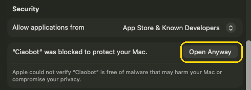

# Ciaobot

<p align="center">
  
</p>

Ciaobot is a **second brain you own** — a local, provider-agnostic AI workspace whose memory is a plain-markdown vault you own outright. Chats, projects, files, schedules, and memory live in one interface, backed by whichever model you choose (Claude Code, OpenAI Codex, and others).

## Install

**macOS 13+ ([Homebrew](https://brew.sh))** — recommended:

```bash
brew install raffaelefarinaro/ciaobot/ciaobot
ciao run
```

Then open `http://localhost:8443` and follow the setup wizard. Finishing it
installs `Ciaobot.app` for you — into `/Applications`, or `~/Applications` on a
non-admin account — so there is no separate app install step. (Installing the
fully qualified formula grants Homebrew trust only to the Ciaobot engine.)

There is no Gatekeeper prompt on this path. macOS only assesses bundles carrying
a download *quarantine* flag, which browsers and Homebrew casks set but a
command-line download does not — so the ad-hoc signed app launches directly.
Because Apple's notarization check is therefore not what guards the download,
the installer verifies the release's minisign signature against the same key the
in-app updater uses, and refuses to install anything that fails.

If the download fails — offline, proxy, firewall — setup says so and continues
with the menu-bar launcher instead of failing. Install the app whenever you like:

```bash
ciao desktop install
```

Pass `--no-desktop-app` to `ciao setup` to skip it deliberately. Later updates
come from the app's own **Update…** action, which updates the engine and desktop
app together.

Already using the Homebrew engine from an earlier release? Move to the app
without recreating your workspace:

```bash
brew update
brew trust --formula raffaelefarinaro/ciaobot/ciaobot
brew upgrade ciaobot
ciao desktop install
```

(An existing workspace has already been through setup, so the app install is the
one step left — hence running it directly here.)

If `Ciaobot.app` is already installed, `ciao desktop install` stops rather than
writing over it — update from the app instead, or remove it first with
`ciao desktop uninstall`. (Overwriting another app's bundle from a terminal needs
macOS App Management permission; letting the app update itself does not.)

<details>
<summary>Installing via the Homebrew cask instead</summary>

The cask still exists and pins the same release:

```bash
brew install --cask raffaelefarinaro/ciaobot/ciaobot-desktop
```

Homebrew quarantines what it downloads, so this path *does* hit the Gatekeeper
block — the app is ad-hoc signed and not notarized, and macOS reports *"Apple
could not verify Ciaobot is free of malware"*. Open `Ciaobot.app` once to trigger
the block, then go to **System Settings → Privacy & Security** and scroll to
**Security**:



Click **Open Anyway**, authenticate, then launch the app again and confirm
**Open**. Control-clicking the app and choosing **Open** does *not* clear this
dialog — Apple removed that bypass in macOS 15 — and the **Open Anyway** button
only appears for about an hour after a blocked launch, so re-trigger the block if
you don't see it. Do not disable Gatekeeper. `ciao desktop install` avoids all of
this.

</details>

Upgrade the engine in the same sitting. The engine and app ship from one tag and
are meant to report the same version; a split between them surfaces as an opaque
`Invalid desktop-service response`, because the app resolves the `ciao`
executable from fixed Homebrew paths.

The first app launch reuses the existing workspace and server LaunchAgent,
removes the retired menu-bar helper, and moves the old `Ciaobot Server.app` to
the Trash once the engine is reachable. Browser-installed PWA shortcuts are
left alone.

**Any platform ([PyPI](https://pypi.org/project/ciaobot/))** — or macOS without Homebrew; requires Python 3.12 or newer:

```bash
python3.13 -m venv ~/.ciaobot-venv
~/.ciaobot-venv/bin/pip install ciaobot
~/.ciaobot-venv/bin/ciao run
```

Then open `http://localhost:8443` and follow the setup wizard:

- **Workspace folder** (default `~/ciaobot`) — your second brain (`memory-vault/`) plus app config and runtime state. Sync this folder (GitHub, Drive, iCloud, …) so your vault follows you across machines.
- **Dashboard password** — Ciaobot is password-protected by default: this is what you type to open it, and what another device needs to connect as a client. Change it later in Settings → PWA password.
- **Model provider** — Claude Code, Codex, or another configured backend.

The wizard writes config, initializes the workspace as a git repo (with a `.gitignore` for secrets and runtime state), and installs the macOS engine LaunchAgent. A cask installation uses `Ciaobot.app`; package-only installs retain the legacy recovery launcher during the migration release.

For scripted setups: `ciao setup --workspace <dir> --auth-token <password>` (a random password is generated into `.env` when omitted; `--no-auth` opts out of protection entirely). If a setup link returns `invalid setup token`, mint a fresh one with `ciao setup-url --workspace <dir>`.

Contributors running from a git checkout: see [docs/DEVELOPMENT.md](docs/DEVELOPMENT.md).

## Why it exists

Ciaobot started from the limits of Claude Cowork. Cowork is genuinely good at *doing the work* — it runs on your own desktop, edits your own files, and follows along on your phone. But it's Claude-only, and everything it learns about *you* — your sessions, your context, your history — lives in an account you rent. It knows you no better on day 365 than on day 1: it remembers *sessions*, not *you*.

Ciaobot is the other bet — differences that are structural, not features:

- **Any model, local or cloud.** Claude Code, OpenAI Codex, Ollama (local or cloud), or OpenRouter — the second brain outlives any single model, and lighter tasks can run entirely on your own hardware.
- **Your machine's own power.** Voice is already wired to work on-device: dictation and read-aloud run on your computer (Apple Silicon) with no cloud round-trip needed.
- **Accrual, not storage.** A memory system, baked in, that curates itself and compounds into *you* over time — not a pile of past sessions.
- **Yours to keep.** That memory is plain markdown in a git repo you own outright — portable, and useful even if this app disappears.

The coworker is just the interface. The second brain is the product.

## It follows you — without leaving your machine

Ciaobot runs on your computer, but you're not chained to your desk. The PWA is built mobile-first with push notifications, and over [Tailscale](https://tailscale.com/) your phone reaches the machine at home on a private mesh — the same desk-to-phone continuity as a cloud assistant, without shipping your work to anyone's servers. The one honest trade: the host has to be awake. When the machine sleeps, so does your second brain.

## Who it's for

Ciaobot is built for **knowledge work, not software development**: brainstorming, research, writing and editing, planning, and document work — typically drafted as markdown in a local vault, then published to Google (Docs, Drive, Sheets) when ready.

- **Not built for** day-to-day coding. There is no code editor or repo tooling in the UI — keep using your IDE for that.
- **Google Workspace** — Gmail, Calendar, Drive, Docs, Sheets, Slides, and Tasks through Google's [`gws` CLI](https://github.com/googleworkspace/cli), connected with browser-based OAuth from Settings.

## The idea

Ciaobot does not reinvent how you talk to agents. It runs [Claude Code](https://github.com/anthropics/claude-code) or [OpenAI Codex](https://developers.openai.com/codex/cli/) in the background, on the bet that the vendors' own CLIs are the best-maintained agent harnesses available — they keep the model communication, tool use, and agentic loop optimized so this project doesn't have to. Ciaobot stays in control of the three things that matter to me:

1. **The context** — deciding exactly what memory, notes, and project state the agent is fed each turn.
2. **One interface** — the same UI regardless of which project or provider you're talking to.
3. **Incremental capabilities** — features are added only when I need them or discover a pattern worth adopting, not speculatively.

The same instinct runs through the infrastructure: rather than build and run servers, Ciaobot stands on primitives that already have millions of users hardening them — **git** for sync, versioning, and durability; **Tailscale** for private remote access; and one **PWA** shared by browsers, phones, and the thin macOS shell. Every hard problem is answered by borrowing a battle-tested tool, not maintaining a new one.

What that looks like in practice:

- **Workspaces and projects** — split life areas (personal, work, a client, …) into sidebar workspaces, then organize work inside projects. Ciaobot injects project notes and context into every turn.
- **A vault you own** — durable knowledge as plain markdown with wikilinks and an `INDEX.md`, inspired by [Andrej Karpathy's LLM Wiki pattern](https://gist.github.com/karpathy/442a6bf555914893e9891c11519de94f). Browse in [Obsidian](https://obsidian.md/) or any editor; sync via GitHub, Drive, or iCloud.
- **Skills, subagents, and commands** — packaged defaults, extensible from Settings or workspace files (see [What ships by default](#what-ships-by-default)).
- **Files and automations** — create, preview, edit, and restore vault files from the UI; run recurring routines on a cron you choose (schedules) or re-run a prompt inside one chat every N minutes (loops).
- **Voice, notifications, and updates** — transcription, push alerts, model settings, and in-app package updates. On macOS, `Ciaobot.app` owns the window, menu bar, native notifications, and desktop updates while the engine runs as a background service.
- **Provider choice** — Claude Code or Codex with your existing login; Ollama, OpenRouter, and on-device models for lighter tasks (see [Providers](#providers)).
- **Agent-safe control plane** — an authenticated, chat-scoped MCP surface lets managed Claude Code and Codex processes operate Ciaobot memory, vault, projects, chats, delegates, schedules, loops, and file history without curl or direct runtime-JSON edits. MCP is the default transport, with the legacy CLI path retained as an automatic fallback. Reads and non-destructive writes on this surface run without an approval card (they are the twins of buttons in the UI); deletes and lifecycle actions still ask. See [docs/MCP.md](docs/MCP.md).

Pick a workspace folder, choose a provider, and work — Ciaobot is the interface on top; the vault is yours to keep.

## Memory and the vault

Ciaobot keeps memory in layers so the agent can recall what matters without stuffing every prompt. **Settings → Context** shows what the agent actually loads.

- **Short agent memory** (fenced `ciao:memory` / `ciao:profile` regions in workspace `CLAUDE.md`) — a small, capped scratchpad the model maintains for you: preferences, conventions, lessons, and profile. Updated with Edit or `/remember`; a snapshot is injected at the start of each Claude/Codex chat. Add `[expires: YYYY-MM-DD]` to a temporary entry to keep it active through that date. It is hidden from later snapshots, but still uses stored character budget until daily memory curation removes it. These regions are git-tracked with the workspace.
- **Your vault** (`memory-vault/`, or a separate vault root per sidebar workspace) — durable markdown you own: people, projects, ideas. Browse it in Obsidian or any editor; it stays useful even without Ciaobot.
- **One behavior file for the install** — `<workspace>/CLAUDE.md` (and `AGENTS.md` for Codex) applies to every chat.

When your message mentions a name that appears in the vault index, the agent gets a quiet hint — “this probably means `People/Emma`” — so it opens the right note without you repeating context. And when a chat is archived, a pipeline turns it into durable knowledge: session insights are extracted, memory proposals are drafted, and daily/weekly curation runs update vault pages — but nothing is promoted into long-term memory without review, and Ciaobot never discards or rewrites an existing notes folder during onboarding. Track the background steps under **Settings → Automation**, and see [docs/ARCHITECTURE.md](docs/ARCHITECTURE.md) for the full pipeline.

## Features

**Chats, projects, and workspaces**

- Sidebar workspaces per life area (personal, work, a client) — each with its own vault, projects, and default model.
- Projects group related chats and inject durable notes and context into every turn.
- Comment on any passage of a reply — select text, attach a note (typed or dictated), and it rides along with your next prompt; queue follow-ups while the agent is still working.
- Per-chat model picker with provider thinking levels on top of per-workspace defaults.
- Fork conversation: create a new independent chat in the same project starting from any completed agent answer, preserving history.
- Delegates: a chat's agent spawns writable delegate chats (own model, own resumable session, full tool access) to work in parallel, and is woken with a fresh turn when each finishes. Capped at 6 per chat; delegates cannot nest.

**Voice — dictation and read-aloud**

- Speech-to-text dictation in any chat: cloud transcription (OpenAI `gpt-transcribe`, overridable via `CIAO_TRANSCRIPTION_MODEL`) or free on-device using macOS speech recognition (macOS 26+, nothing to download).
- Text-to-speech read-aloud of replies: cloud voices or the free on-device macOS system voice. Both on-device engines run through a small helper bundled in `Ciaobot.app`, so there is no model download and no optional package to install. For better read-aloud, [add a Premium voice](https://support.apple.com/guide/mac-help/mchlp2290/mac) in System Settings — Ciaobot uses the highest-quality voice you have installed.

**Files and documents**

- Completed turns surface touched files as clickable `Outputs` chips below the final reply. Expand `Activity` to inspect the chronological notes, tool calls, and file cards; click a file for history, diff, and restore.
- Pin a document beside the chat and add line-level comments on the preview, dictated or typed (attached to your next message, like chat comments).
- Rich previews: images inline, PDFs in a built-in viewer, PowerPoint (`.pptx`) converted to PDF for display (requires LibreOffice on the machine running Ciaobot).
- Create, edit, and restore vault files from the UI, with snapshots behind every agent edit.

**Memory, vault, and insight extraction**

- Layered memory: a capped agent memory and user profile injected at chat start, plus a plain-markdown vault you own (Obsidian-compatible, syncable via GitHub/Drive/iCloud).
- Archiving a chat runs an extraction pipeline: session insights and trajectories are captured, memory proposals are drafted, and project canonical docs are updated — nothing is promoted into long-term memory without review.
- Daily and weekly curation routines keep vault pages and `Workspace/Learnings.md` current.
- Vault-index hints: mention a name the index knows and the agent is quietly pointed at the right note.

**Automations**

- Schedules: recurring or one-off cron routines that dispatch fresh prompts into a project or chat. A schedule-triggered chat carries a banner with Run now / Manage controls, mirroring the loop banner; because a project schedule spawns a new chat each run, the chat holds a durable `schedule_id` backlink (stamped when the schedule creates it) so the banner survives later runs instead of only marking the latest chat.
- Loops: re-run a prompt inside one chat every N minutes, keeping the conversation's context between iterations. A loop-driven chat is marked with `↻` in the sidebar and on the home grid, and carries a banner with start/stop controls; the harness's own `/schedule` and `/loop` skills are removed from the model's context and denied, so automations land in Ciaobot instead of a cloud routine it cannot see.
- System routines ship enabled (memory curation, workspace hygiene, skill evolution); every background run is visible under **Settings → Automation**.

**Extensibility — skills, subagents, commands**

- Stock skills, subagents, and slash commands ship with the app; same-named workspace versions override them.
- Install skills from GitHub repositories; they refresh automatically on restart.
- A weekly skill-evolution routine proposes improvements from real usage — reviewable proposals, never silent edits.

**Providers and models**

- Claude Code or OpenAI Codex with the subscription login you already have; Ollama (cloud or local) and OpenRouter as API backends.
- Claude shell commands stay attached to the active turn until they return a result. Background subagents remain asynchronous and visible in the chat while they run.
- haiku/sonnet/opus tier routing mapped across providers; background tasks (titles, insights) routable to cheaper or on-device models (Apple Intelligence, no install required).

**Google Workspace**

- Gmail, Calendar, Drive, Docs, Sheets, Slides, and Tasks through Google's `gws` CLI, connected with browser OAuth from Settings — no terminal required.

**App surface**

- Installable PWA with web-push notifications and in-app package updates.
- macOS desktop app: one Dock window and menu-bar companion with native notifications, updates, and a launchd-managed engine.
- A local HTTP API an in-chat agent can drive (create chats, subagents, commands — see [PWA_API.md](PWA_API.md)).

## What ships by default

Every install seeds a set of subagents, slash commands, and system routines from the package (`ciao/stock/`); your own workspace versions with the same name take precedence.

### Subagents

Specialized roles the main agent can delegate to ([ciao/stock/agents/](ciao/stock/agents/)):

| Subagent | What it does |
|---|---|
| [memory](ciao/stock/agents/memory.md) | Vault curation, durable note updates, and memory-proposal processing. |
| [researcher](ciao/stock/agents/researcher.md) | Researches current external information and summarizes it with sources. |
| [secretary](ciao/stock/agents/secretary.md) | Calendar, email, reminders, and lightweight admin via the Google Workspace skills; asks before sending anything. |

### Slash commands

Type these in any chat ([ciao/stock/commands/](ciao/stock/commands/)):

| Command | What it does |
|---|---|
| [/remember](ciao/stock/commands/remember.md) | Saves a durable fact or learning to the right memory layer (agent memory, user profile, or a vault page). |
| [/interrogation](ciao/stock/commands/interrogation.md) | Asks a few targeted questions to turn a vague project, person, or idea into a useful canonical vault note. |
| [/critique](ciao/stock/commands/critique.md) | Multi-model adversarial review of a plan or draft, via the `adversarial_review` MCP tool. |
| `/plan` | Enters read-only plan mode, then returns to the chat's previous mode (or auto if unavailable). |

### System routines

Recurring schedules that ship enabled ([ciao/stock/schedules.json](ciao/stock/schedules.json)); they run through the same provider pipeline as a chat turn, and their runs are visible under **Settings → Automation**:

| Routine | Cadence | What it does |
|---|---|---|
| Memory curation | Daily | Reviews recent archived chats, memory proposals, and learnings; updates vault pages and `Workspace/Learnings.md`. Removes bounded-memory entries after a valid `[expires: YYYY-MM-DD]` date and reports malformed expiration tags without guessing. |
| Workspace hygiene | Weekly (Sun) | Regenerates the vault index with `ciao vault-index --write`, then runs `ciao os-audit --json`. It can repair low-risk link and index drift, then verifies the remaining findings. |
| Skill evolution | Weekly (Sun) | Drafts skill-improvement proposals from recent usage; never applies them automatically. |

Your own schedules live alongside these in the workspace (`.runtime/schedules.json`), with in-chat loops in `.runtime/loops.json`; both are managed from the UI's Automations page. Packaged **skills** (vault search, Google Workspace, web research, and more) are browsable under **Settings → Assets** and live in [ciao/stock/skills/](ciao/stock/skills/).

## Providers

Use the access you already have:

- **Claude Code** — CLI-managed Claude subscription or Anthropic Console authentication.
- **OpenAI Codex** — `codex login`, including eligible ChatGPT subscription accounts.
- **Ollama** — cloud or local daemon.
- **OpenRouter** — `OPENROUTER_API_KEY`.
- **On-device models** — for lightweight tasks where available: chat titles via Apple's on-device Foundation Model, dictation and read-aloud via the built-in macOS speech frameworks. All of it ships with macOS; none of it needs installing.

See [INTEGRATIONS.md](INTEGRATIONS.md) for env vars, OAuth, and per-task model routing (titles, insights, voice).

## A personal project, shared

Ciaobot is my idea of an AI assistant that belongs to you, not to a vendor: it runs on your machine, talks to whichever model you choose, and turns your work into a second brain you keep in plain files. I built it for my own use and run it on my own machines; the defaults reflect that: project-first navigation, a plain-markdown vault as memory, explicit model routing, and self-improvement loops that propose changes instead of applying them blindly.

I'm sharing it because the patterns may be useful to you. Ideas, bug reports, disagreements with my defaults, and pull requests (`#agentswelcome`) are welcome — see [CONTRIBUTING.md](CONTRIBUTING.md).

## Documentation

| Doc | What's in it |
|---|---|
| [docs/ARCHITECTURE.md](docs/ARCHITECTURE.md) | System design: repo and workspace layout, chat pipeline, memory, schedules, providers. |
| [docs/MCP.md](docs/MCP.md) | Embedded MCP architecture, security, complete tool catalog, Claude/Codex process configuration, and paired evaluation. |
| [docs/DEVELOPMENT.md](docs/DEVELOPMENT.md) | Git checkout, dev workflow, testing, change guidelines. |
| [INTEGRATIONS.md](INTEGRATIONS.md) | Env vars, OAuth, MCP connectors, server runtime knobs. |
| [PWA_API.md](PWA_API.md) | API endpoints, auth flow, state paths, agent recipes. |
| [web/README.md](web/README.md) | PWA frontend workflow, iOS Safari gotchas, design tokens. |
| [SECURITY.md](SECURITY.md) | Security policy. |
| [CONTRIBUTING.md](CONTRIBUTING.md) | How to contribute. |
| [docs/CREDITS.md](docs/CREDITS.md) | Open tools Ciaobot is built on. |

Naming note: the user-facing product is **Ciaobot**. The CLI is installed as both `ciaobot` and `ciao` (same command); the Python package, import path, and many environment variables are still named `ciao`/`CIAO_*` for compatibility.

## Why "Ciao"?

*Ciao* isn't just Italian for "hi" and "bye" — it comes from the Venetian phrase *s-ciào vostro* ("[I am] your slave"), a servile greeting that shed its literal meaning over the centuries and became the everyday word Italians use today. Fitting for an assistant: yours to command. See the [etymology on Wikipedia](https://en.wikipedia.org/wiki/Ciao#Etymology).

## Built on

Ciaobot is glue around a lot of excellent open tools — Claude Code, the Claude Agent SDK, Codex CLI, Starlette, Vue, and more. See [docs/CREDITS.md](docs/CREDITS.md) for the full list.
