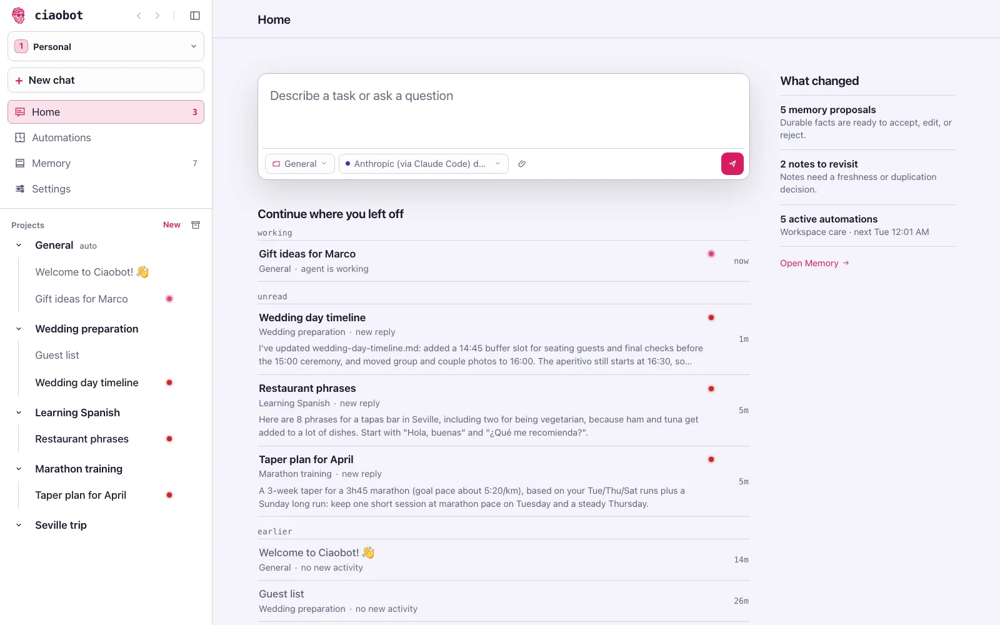

# Ciaobot

<p align="center">
  
</p>

Ciaobot is your **second brain and personal assistant**. It is built on top of the CLIs you already use, such as [Claude Code](https://github.com/anthropics/claude-code) and [opencode](https://opencode.ai), and gives you one interface for working with them.

You are not tied to one CLI, model, or provider. Use Claude, opencode with a cloud or local model, or switch between them as needed. Ciaobot keeps the interface and the context consistent while your work, chats, and memory remain in a folder you own and can reuse with any CLI in the future.

## Install

**macOS 13+ on Apple Silicon (M1 or newer):**

```bash
curl -fsSL https://github.com/raffaelefarinaro/ciaobot/releases/latest/download/install.sh | sh
```

Installs the engine with uv, starts it as a LaunchAgent, and prints a one-time link. Open `http://localhost:8443` and follow the setup wizard. It will help you choose or create your workspace, set a dashboard password, and connect the provider you want to use.

During setup you choose the folder where Ciaobot keeps your notes and memory: a new folder, or an existing one such as an Obsidian vault. It stays yours, in plain Markdown, usable with any other tool.

### Connect your agent

Ciaobot has no model account of its own. It drives a CLI you have already signed in to:

- **Claude:** install [Claude Code](https://docs.anthropic.com/en/docs/claude-code/overview) (`curl -fsSL https://claude.ai/install.sh | bash`, then add `~/.local/bin` to your `PATH` if needed) and run `claude auth login`.
- **OpenAI, OpenRouter, Ollama and others:** install [OpenCode 2.0.16+](https://opencode.ai/v2/docs/) (`npm install -g @opencode/cli`; see [INTEGRATIONS.md](INTEGRATIONS.md#opencode) for other routes) and authenticate the provider there. Its models appear in Ciaobot's model picker.

See [INTEGRATIONS.md](INTEGRATIONS.md) for current commands. Contributors running from a git checkout: [docs/DEVELOPMENT.md](docs/DEVELOPMENT.md).

### Upgrading from the macOS app

v1.0.0 retires the macOS `Ciaobot.app`; the PWA is now served by the engine. To move over and keep your workspace, password, chats and schedules, run the installer with `--migrate`:

```bash
curl -fsSL https://github.com/raffaelefarinaro/ciaobot/releases/latest/download/install.sh | sh -s -- --migrate
```

Details are in [INTEGRATIONS.md](INTEGRATIONS.md#install). Updates are the same one-liner again, or **Settings → General** in the PWA.

### Uninstall

To stop the engine, use its own service command:

```bash
ciao service stop
```

That stops the `com.ciao.server` LaunchAgent; your workspace folder is kept, and `ciao service start` brings it back. A leftover legacy `Ciaobot.app` is removed with `ciao desktop uninstall`.

## How it works

Work is organised as **workspace → project → chat**. A workspace is a big area of your life (personal, work, a client) with its own memory; a project holds the background for a topic; a chat is one task. When you finish a chat, archive it and Ciaobot files what is worth keeping into your notes, as plain Markdown in the folder you chose.

<p align="center">
  
</p>

Everything you can click, you can also ask for in a chat.

**Full guide, features, memory, models and remote access: [raffaelefarinaro.com/ciaobot](https://www.raffaelefarinaro.com/ciaobot/).**

## Documentation

| Doc | What's in it |
|---|---|
| [docs/ARCHITECTURE.md](docs/ARCHITECTURE.md) | System design, workspace layout, chat pipeline, memory, schedules, and providers. |
| [docs/AGENT_CLI.md](docs/AGENT_CLI.md) | CLI-first agent surface: transport, security, operation catalog, and provider configuration. |
| [docs/DEVELOPMENT.md](docs/DEVELOPMENT.md) | Git checkout, development workflow, testing, and change guidelines. |
| [INTEGRATIONS.md](INTEGRATIONS.md) | Environment variables, OAuth, and integration configuration. |
| [PWA_API.md](PWA_API.md) | API endpoints, authentication, state paths, and agent recipes. |
| [web/README.md](web/README.md) | PWA development workflow and frontend details. |
| [SECURITY.md](SECURITY.md) | Security policy. |
| [CONTRIBUTING.md](CONTRIBUTING.md) | Contribution guidelines. |
| [docs/CREDITS.md](docs/CREDITS.md) | Open tools Ciaobot is built on. |

The user-facing product is **Ciaobot**. The CLI is installed as both `ciaobot` and `ciao`; the Python package and many environment variables still use `ciao`/`CIAO_*` for compatibility.

## Built on

Ciaobot is glue around excellent open tools: Claude Code, the Claude Agent SDK, opencode, Starlette, Vue, and more. See [docs/CREDITS.md](docs/CREDITS.md) for the full list.
