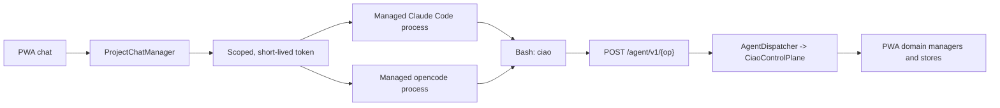

# Ciaobot agent CLI control plane

Since the S6 slice of the CLI-first migration, Ciaobot's own control surface
for the two supported providers, Claude and OpenCode, is a command line:
every operation runs as `ciao <noun> <verb> … --json` inside the managed
provider's shell, described by one skill document
(`ciao/stock/skills/ciao-cli/SKILL.md`). The MCP adapter and `/mcp/` mount are
gone. What remains is the transport-free core the dispatcher needs: the shared
operation table, the bearer-token registry, the plan-mode gate/envelope/
telemetry, and the third-party project MCP server management surfaced by
Settings (which is the agent's *external* tools and is unrelated to Ciaobot's
own surface).

There is no CLI/direct-file fallback and no per-chat surface switch: a chat
whose control plane is unavailable fails the turn with a visible error rather
than running an agent that cannot reach Ciaobot.

## Process and trust model

- **Delivery (D-01).** Ciaobot injects the bearer capability into the managed
  provider's **foreground** shell as `CIAO_AGENT_TOKEN` (with `CIAO_AGENT_URL`
  as the loopback base). This deliberately reverses the old "never in the shell
  env" invariant: CLI-first requires the agent's shell to hold chat authority.
  Background runs keep the protection: `ciao/background.py` strips
  `CIAO_AGENT_TOKEN` (and `PWA_AUTH_TOKEN`) from every background child, so a
  detached command cannot call back into the agent surface with the caller's
  authority, outliving the turn that was approved.
- **Transport.** `ciao` posts `{op, arguments}` to `POST /agent/v1/{op}` with
  `Authorization: Bearer <token>`. `AgentDispatcher` verifies the token with
  `AgentSessionRegistry` (formerly `McpSessionRegistry`), resolves the operation
  from the shared table in `ciao/mcp_server.py`, and runs it through the same
  auth context — so every control-plane guard, the `{ok,data}` envelope,
  argument validation and telemetry are shared. Identity never comes from
  arguments: `--chat` and friends are ordinary parameters authorised by the
  control plane against the token's principal.
- **What the scope enforces, precisely.** The authorization checks are
  *workspace* confinement plus *chat attribution* — not chat isolation. Every
  ownership test terminates in `CiaoControlPlane._workspace`, which compares
  against `principal.workspace`, and `_chat_scope` authorizes any chat through
  the workspace of the project that owns it. So a chat's token can read,
  message, retitle, archive and delete **other chats in the same workspace**; it
  cannot touch another workspace. The chat half of the principal drives the
  plan-mode gate, the child-mode ceiling, background-run ownership, revocation
  granularity, and per-chat telemetry — and it lets an operation recognise its
  own chat so it does not tear down its own caller.
- The scope is also not a containment boundary against the model itself. The
  same process holds native Read/Bash/Edit over its workspace root, so the
  control plane is the *convenient* path to Ciaobot state, not the only one.
  `.env` (which holds `PWA_AUTH_TOKEN`), `.runtime/` and `secrets/` are denied
  to the native file tools on both providers — see `credential_path_deny_rules`
  in `ciao/execution_modes.py`, which also states what that deny does not cover
  (the shell).
- A chat whose control plane is unavailable fails the turn:
  `build_agent_request` raises `AgentSurfaceUnavailableError`, which is
  published as a normal failed turn with a logged ERROR. The
  `GET /api/agent/status` endpoint (Settings → Agent CLI) and server logs show
  the cause.
- Plan-mode chats cannot call mutating operations. Results use stable
  `{ok,data}` / `{ok:false,error}` envelopes, and inputs are validated again by
  the domain manager.
- An operation cannot stop its own active turn. Operations that would disconnect
  the caller — current-chat session reset/handover/archive/delete, restart, or
  package update — are queued until that chat is idle.
- Operation telemetry is appended to `.runtime/mcp_tool_calls.jsonl` with
  `surface: "cli"`; provider tool selection is appended to
  `.runtime/agent_tool_calls.jsonl`. Neither file records arguments.
- `mcp_tool_calls.jsonl` is size-capped like the job-run log: past ~2 MB it is
  trimmed to the newest 2000 records. Detailed records therefore cover only that
  retained window, but the per-tool counters of everything dropped are rolled
  into `.runtime/mcp_tool_calls_totals.json` first, so the Settings usage table
  keeps reporting lifetime totals. `GET /api/mcp/usage` states the split rather
  than leaving it implied. Telemetry is best-effort in both directions.

## Permission model (D-05 / D-13)

On the CLI surface every control-plane call is the harness's own shell tool, so
the per-tool annotations that used to feed a static allow-list are gone. The
allow/ask split is now a command-line prefix rule:

- `AGENT_CLI_ALLOW_PATTERNS` / `AGENT_CLI_ASK_PATTERNS` in
  `ciao/execution_modes.py` map each `ciao <noun> <verb>` command to one class.
  The ask class is every command whose operation carries the `_DESTRUCTIVE`
  annotation (`chat delete/stop`, `project complete/delete`,
  `schedule pause/resume/run/delete`, `run start/cancel`) plus the deciding half
  of `vault review` (keep/trash/restore/delete).
- Claude appends `Bash(<pattern>:*)` entries to `options.allowed_tools` for
  auto/bypass chats. opencode emits matching `bash` pattern `allow`/`ask` rows
  in auto mode (`mode_settings`).
- **These are UX, not the security boundary.** An argv prefix is bypassable
  (`sh -c`, a Python subprocess). The floor stays server-side in the control
  plane (mode gates, `unattended_forbidden`, workspace confinement). What the
  rules buy is that a cooperative agent doing routine work does not raise a
  card, and that a destructive verb still does. `ciao eval contracts` and
  `tests/test_agent_surface.py` assert every documented command falls in exactly
  one class and that no destructive verb is in the allow class.

## Managed provider configuration

Users do not maintain a static `.mcp.json` for Ciaobot's own control plane —
there is no Ciaobot MCP server to attach. Every chat is on the CLI surface, so
`ProjectChatManager.build_agent_request` always injects `CIAO_AGENT_URL` and
`CIAO_AGENT_TOKEN` into the foreground shell. The provider's own process is
restarted when the token changes (`provider_reuse_key`).

Separately, Settings → Assets → MCP servers can create, update, and delete
**project** MCP server entries in the workspace `.mcp.json` (stdio/HTTP), write
matching env-key secrets into `.env`, and probe tools
(`POST/PATCH/DELETE /api/mcp/servers`, `GET /api/mcp/servers/{name}/tools`).
Those third-party servers are the agent's *external* tools and stay MCP; they
are distinct from Ciaobot's own surface.

Static configuration in an unrelated terminal is intentionally unsupported: the
token is a live chat capability, not an operator credential. Use Ciaobot's
managed Claude Code or opencode process so scope, revocation, deferred
self-actions, and telemetry remain enforced.

## Operation catalog

The operation table in `ciao/mcp_server.py` is the single source the dispatcher
runs; `ciao/stock/skills/ciao-cli/SKILL.md` is the command reference and
`GET /api/agent/status` reports the live operation list. The catalog covers
application actions that are safe and meaningful for a scoped agent:
bounded memory (`ciao memory status|update`), vault (`ciao vault search`,
`ciao vault review …`), projects (`ciao project …`), workspaces
(`ciao workspace list`), chats (`ciao chat …`), background runs
(`ciao run …`), schedules (`ciao schedule …`), Google Workspace
(`ciao gws status`), context (`ciao context get`), and file surfacing
(`ciao file surface`). Browser-session administration, login/OAuth secrets, and
raw server deploy endpoints remain PWA/operator-only.

## Skills and system-prompt policy

The CLI replaces the transport recipes, not behavioural knowledge. Ciaobot's
core prompt tells the agent to use `ciao <noun> <verb>` commands for the
control plane (the compact command table lives in `ciao/system_prompt.md`) and
keeps `ciao help` / `ciao <noun> --help` as the long reference. Provider and
integration skills — Google Workspace, research, document authoring — remain
useful because the CLI does not encode those domain decisions.

## Validation status

The default — and now only — control surface is `cli` for both supported
providers. The MCP-versus-CLI comparison (the S0.5 spike of the migration plan)
measured real-session parity (completion 86%/100% per provider on both
surfaces, zero fallbacks) and drove the D-11 name resolution, D-12 command
table in the core prompt, and D-13 argv rules that make the CLI surface
practical in auto mode. The MCP surface itself was removed in S6.
