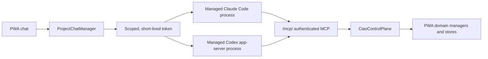

# Ciaobot MCP control plane

Ciaobot embeds an authenticated Streamable HTTP MCP server at `/mcp/`. It is
an agent-facing adapter over the same Python managers used by the PWA; it is
not a second API implementation and it never asks a model to edit `.runtime`
JSON directly.

MCP is the default control surface for both providers. `legacy` (the
CLI/direct-file path) is retained as a hidden fallback: it is still selectable
via `CIAO_CONTROL_SURFACE=legacy` or the per-chat `control_surface` field, and
it is used automatically when the MCP server is unavailable. The PWA no longer
exposes a per-chat surface selector; the transport is engine-controlled. `auto`
uses `.runtime/control_surface_decision.json` per provider and resolves to
legacy when the decision is missing, tied, partial, or invalid.

## Process and trust model



- The server issues a random bearer token scoped to chat, project, workspace,
  provider, and role. Tokens are reused only for that scope, expire, and are
  revoked on session reset, handover, archive, or deletion.
- Ciaobot injects credentials only while it launches the provider process.
  They are not placed in the normal model shell environment. Codex receives
  the token through a dedicated environment variable that its shell policy
  excludes; Claude receives it in the SDK MCP header configuration.
- Because MCP is the default transport, a chat whose MCP server or token is
  unavailable degrades gracefully to the legacy path with a logged WARNING,
  rather than failing the turn. This keeps the app usable during bootstrap or
  when `CIAO_MCP_ENABLED=false`. The `GET /api/mcp/status` readiness display
  (Settings) and server logs make the fallback observable. A mid-turn outage
  of an already-live MCP session surfaces through the CLI/tool-call error path
  and server logs rather than a strict-config launch failure (see the note on
  `strict_mcp_config` below).
- Plan-mode chats cannot call mutating tools. Agent-handoff participants
  are read-only. Tool results use stable `{ok,data}` / `{ok:false,error}`
  envelopes, and inputs are validated again by the domain manager.
- A tool cannot stop its own active turn. Operations that would disconnect the
  caller—current-chat session reset/handover/archive/delete, restart, or package
  update—are queued until that chat is idle.
- Tool telemetry is appended to `.runtime/mcp_tool_calls.jsonl`; provider tool
  selection is appended to `.runtime/agent_tool_calls.jsonl`. Neither file
  records tool arguments.

## Managed Claude Code configuration

Users do not maintain a static `.mcp.json` for Ciaobot. For an MCP chat,
`ClaudeProvider` constructs the equivalent of:

```python
ClaudeAgentOptions(
    mcp_servers={
        "ciaobot": {
            "type": "http",
            "url": "http://127.0.0.1:<pwa-port>/mcp/",
            "headers": {"Authorization": "Bearer <scoped-token>"},
        }
    },
    # strict_mcp_config is intentionally left off — see below.
)
```

The managed Claude process is restarted when its MCP token changes.

`strict_mcp_config` is **not** set on the chat path. The SDK's
`McpHttpServerConfig` has no per-server "required" flag, so the only way to
guarantee the Ciaobot server is the global strict switch — but strict mode
restricts the CLI to *only* the servers in `mcp_servers` and ignores every
other MCP source, which includes the account's claude.ai connector MCPs
(`mcp__claude_ai_*`). Forcing it therefore suppressed all connectors regardless
of the per-workspace `claude_ai_mcps` toggle (that was a bug: the toggle became
dead UI on the MCP surface). Connectors now stay loaded and are gated solely by
the per-workspace `disallowed_tools` denylist. A Ciaobot server that is
unavailable at spawn time already degrades to the legacy surface (above), so
strict mode is not needed to surface that case.

## Managed Codex configuration

For Codex, Ciaobot launches its persistent app-server with per-process config
overrides equivalent to:

```text
codex \
  -c 'mcp_servers.ciaobot.url="http://127.0.0.1:<pwa-port>/mcp/"' \
  -c 'mcp_servers.ciaobot.bearer_token_env_var="CIAO_MCP_SESSION_TOKEN"' \
  -c 'mcp_servers.ciaobot.enabled=true' \
  -c 'mcp_servers.ciaobot.required=true' \
  -c 'shell_environment_policy.exclude=["CIAO_MCP_SESSION_TOKEN"]' \
  app-server --stdio
```

Only that child process receives `CIAO_MCP_SESSION_TOKEN`. A model-created
shell command does not. The app-server is restarted when the token changes.

Static configuration in an unrelated terminal is intentionally unsupported:
the token is a live chat capability, not an operator credential. Use Ciaobot's
Claude Code or Codex process so scope, revocation, deferred self-actions, and
telemetry remain enforced.

## Tool catalog

The catalog contains 42 explicit tools. The MCP `tools/list` response is the
live list, so clients do not need to infer it from documentation. The catalog
holds *capabilities* — orchestration and search that a shell can't cheaply
replicate. Plain plumbing that the managed Claude Code/Codex session can do
with its own shell and filesystem is not duplicated as an MCP tool:

- **Bounded memory** read/add/replace/remove → `ciao memory read|add|replace|remove`.
- **Vault maintenance** → `ciao index` (index refresh) and `ciao lint`.
  `vault_search` stays — it wraps a maintained FTS5 index a file tool can't
  replicate.
- **Workspace file** read/write and **file history/snapshots** → the model's
  native Read/Write/Glob tools and the workspace git repo.
- **Local session** status/preflight/handback/resync → the shell agent's own
  git; the PWA "Sync to Remote" feature drives the control plane over REST.
- **Agent assets** → `ciao health get|fix` (workspace health) and
  `ciao skills list` / `ciao skills-sync`.
- **Vault note wrappers** (`vault_note_read`/`_write`/`_notes_list`) were never
  added, for the same reason.

`context_get` now also carries the former `system_status_get` under its
`system` key. `capabilities_get`, `automation_runs_list`, `debug_issues_get`,
`agent_context_get`, `chat_mark_read`, `package_status_get`, and the deferred
`lifecycle_*` tools were dropped as host/PWA concerns. Retry, new-session,
and the schedule/loop lifecycle verbs are folded into parameterized tools
(`chat_retry` with an `action`, `chat_handover` with empty provider/model for
an in-place new session, `schedule_action`, `loop_action`).

| Domain | Tools |
|---|---|
| Context | `context_get` (includes `system` status) |
| Bounded memory | `memory_proposals_list`, `memory_proposal_resolve` |
| Vault | `vault_search` |
| Projects | `projects_list`, `project_get`, `project_create`, `project_update`, `project_complete`, `project_restore`, `project_delete`, `project_files_list` |
| Chats | `chats_list`, `chat_get`, `chat_create`, `chat_update`, `chat_send`, `chat_continue`, `chat_retry`, `chat_handover`, `chat_fork`, `chat_archive`, `chat_delete`, `chat_stop` |
| Agent handoffs | `handoffs_list`, `handoff_start`, `handoff_send`, `handoff_events`, `handoff_close`, `handoff_cancel`, `handoff_extend` |
| Adversarial review | `adversarial_review` |
| Schedules | `schedules_list`, `schedule_preview`, `schedule_create`, `schedule_update`, `schedule_action` |
| Loops | `loops_list`, `loop_create`, `loop_update`, `loop_action` |
| Workspace files | `file_surface` |

The catalog covers application actions that are safe and meaningful for a
scoped agent. Browser-session administration, login/OAuth secrets, Web Push
subscriptions, microphone/audio blobs, setup-wizard actions, arbitrary runtime
store writes, and raw server deploy endpoints remain PWA/operator-only. Google
Workspace continues to use its dedicated `gws` tools and skills; third-party
MCP connectors remain provider/workspace configured.

## Skills and system-prompt policy

MCP replaces transport recipes, not behavioral knowledge.

- On the MCP surface, Ciaobot removes the long CLI/curl/direct-JSON recipes
  from its generated system prompt and tells the agent to use the typed tools.
- Ciaobot-owned skills become short semantic guides: when to create a schedule,
  confirmation policy, vault conventions, and workflow composition. They should
  not duplicate tool schemas.
- Provider and integration skills—Google Workspace, research, document
  authoring, role/persona workflows—remain useful because MCP does not encode
  those domain decisions.
- The legacy CLI/curl/direct-JSON recipes have been removed from the default
  generated prompt and the Ciaobot-owned skills. They now survive only in the
  base `ciao/system_prompt.md`, which feeds the hidden legacy fallback, so the
  fallback path still carries CLI references. They can be deleted entirely only
  after every supported provider has a decisive MCP result and the rollback
  window has passed.
- A minimal system prompt always remains: security/approval rules, workspace
  identity, memory semantics, project context, and cross-provider behavior are
  application policy rather than tool descriptions.

## Paired release evaluation

Run the smoke suite first:

```bash
ciao benchmark-control-surfaces --smoke
```

The release-grade run is:

```bash
ciao benchmark-control-surfaces \
  --provider claude --provider codex \
  --repeats 5 \
  --output benchmark-results/full
```

This runs 12 scenarios × 5 repeats × 2 arms × 2 providers = **240 live
turns**. Each legacy/MCP pair starts concurrently against isolated full-stack
servers and identical fixtures. The suite covers bounded-memory CRUD/read,
vault read/search/write, workspace file round-trip, PWA project/chat creation,
schedule list/create, and loop creation.

Every run records:

- orchestrator wall time and provider duration;
- raw provider usage plus a provider-correct token total;
- provider tool names, MCP tool names, and MCP errors;
- durable state or required output correctness;
- surface compliance (zero MCP calls for legacy; at least one authenticated MCP
  call for MCP).

Hard account/provider blocks such as exhausted workspace credits or an
organization spend limit are classified separately. The affected pair is
excluded from efficiency metrics, the provider run stops early, and promotion
is refused until the missing pairs can be rerun; a quota failure is neither a
legacy win nor an MCP failure.

An arm is eligible at 95% correctness and 95% surface compliance. Eligible
arms score 60 points for correctness, 10 for compliance, 15 for median latency,
10 for token efficiency, and 5 for provider-tool efficiency. A lead below
three points is a tie. `REPORT.md`, `results.json`, isolated workspaces, server
logs, and telemetry remain under the output directory.

Promotion is explicit and refuses smoke/partial/tied results:

```bash
ciao benchmark-control-surfaces \
  --provider claude --provider codex \
  --repeats 5 \
  --output benchmark-results/full \
  --apply-to-workspace /path/to/ciaobot-workspace
```

This writes `.runtime/control_surface_decision.json`. Set
`CIAO_CONTROL_SURFACE=auto` (or choose Auto per chat) to consume the promoted
provider-specific winner.

## Validation status

### Default cutover (2026-07-19)

The default control surface was flipped from `legacy` to `mcp` for both
providers on the strength of two independent 120-turn paired runs on the
`claude` managed provider, both of which decisively favored MCP:

- Ollama `minimax-m3:cloud` (production opus-tier): legacy 51/60 (85%) vs MCP
  59/60 (98.3%), higher score, zero quota blocks. The legacy hand-editing path
  was materially less reliable (`loop_create` persisted 0/4, `vault_write`
  content dropped).
- OpenRouter `anthropic/claude-sonnet-5`: legacy 60/60 vs MCP 60/60, MCP faster
  with 75% fewer tool calls (+9.56).

MCP is at least as correct, materially faster, and far cheaper on tool calls.
Codex has no decisive benchmark yet (credit-blocked), so the legacy recipes are
kept as a hidden fallback rather than deleted, and the default flip applies
server-wide via `config.control_surface` rather than per provider.

### Promotion / `auto` status (2026-07-18)

No provider has been promoted through the formal 240-turn release evaluation, so
`auto` continues to resolve to `legacy`. This is independent of the default
above: the default governs chats that do not opt into `auto`.

The Codex release run attempted all 120 turns. Three final scenario pairs were
hard-blocked after the workspace exhausted its credits, leaving 57 evaluable
pairs per arm. Reclassified results are:

| Arm | Correctness | Surface compliance | Median wall | Mean tokens | Mean provider tools | Score |
|---|---:|---:|---:|---:|---:|---:|
| Legacy | 56/57 (98.25%) | 57/57 (100%) | 26.885 s | 26,007 | 4.46 | 94.27 |
| MCP | 56/57 (98.25%) | 53/57 (92.98%) | 22.808 s | 26,277 | 2.32 | 98.14 |

MCP's provisional score is 3.87 points higher, but it is ineligible because it
misses the 95% surface-compliance gate. Three misses were correct workspace
file results produced through native Edit/Bash instead of the typed Ciaobot
file tools; the fourth was a symmetric 300-second schedule timeout. The MCP
instruction has since been tightened for explicitly requested Ciaobot file
operations, but that change requires a fresh fixed-configuration run after
provider credits are available. The three credit-blocked pairs also make the
overall provider decision `blocked`, independently of eligibility.

The Claude smoke run completed no evaluable pair because both arms immediately
hit the organization's monthly spend limit. It likewise has no decision.
