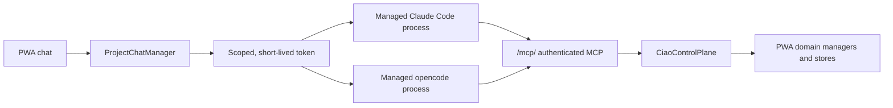

# Ciaobot MCP control plane

Ciaobot embeds an authenticated Streamable HTTP MCP server at `/mcp/`. It is
an agent-facing adapter over the same Python managers used by the PWA; it is
not a second API implementation and it never asks a model to edit `.runtime`
JSON directly.

MCP is the only control surface for the two supported providers, Claude and
OpenCode, and it is mandatory. There is no CLI/direct-file fallback, no
`CIAO_CONTROL_SURFACE` setting, and no per-chat surface field: a chat whose
control plane is unavailable fails the turn with a visible error rather than
running an agent that cannot reach Ciaobot.

## Process and trust model


```mermaid
flowchart LR
    PWA["PWA chat"] --> PCM["ProjectChatManager"]
    PCM --> TOKEN["Scoped, short-lived token"]
    TOKEN --> CLAUDE["Managed Claude Code process"]
    TOKEN --> OPENCODE["Managed opencode process"]
    CLAUDE --> MCP["/mcp/ authenticated MCP"]
    OPENCODE --> MCP
    MCP --> CP["CiaoControlPlane"]
    CP --> MANAGERS["PWA domain managers and stores"]
```

- The server issues a random bearer token scoped to chat, project, workspace,
  provider, and role. Tokens are reused only for that scope, expire, and are
  revoked on session reset, handover, archive, or deletion.
- Ciaobot injects credentials only while it launches the provider process.
  They are not placed in the normal model shell environment. Claude receives
  the token in the SDK MCP header configuration; opencode receives equivalent
  scoped process configuration.
- Because MCP is the only transport, a chat whose MCP service or project is
  unavailable fails the turn: `build_agent_request` raises
  `McpUnavailableError`, which is published as a normal failed turn with a
  logged ERROR. The `GET /api/mcp/status` readiness display (Settings) and
  server logs show the cause. A mid-turn outage of an already-live MCP session
  surfaces through the CLI/tool-call error path and server logs rather than a
  strict-config launch failure (see the note on `strict_mcp_config` below).
- Plan-mode chats cannot call mutating tools. Tool results use stable
  `{ok,data}` / `{ok:false,error}` envelopes, and inputs are validated again by
  the domain manager.
- A tool cannot stop its own active turn. Operations that would disconnect the
  caller—current-chat session reset/handover/archive/delete, restart, or package
  update—are queued until that chat is idle.
- Tool telemetry is appended to `.runtime/mcp_tool_calls.jsonl`; provider tool
  selection is appended to `.runtime/agent_tool_calls.jsonl`. Neither file
  records tool arguments.

## Managed Claude Code configuration

Users do not maintain a static `.mcp.json` for the **embedded Ciaobot** HTTP
adapter — that server is injected at chat spawn with a scoped bearer token.
Separately, Settings → Assets → MCP servers can create, update, and delete
**project** MCP server entries in the workspace `.mcp.json` (stdio/HTTP), write
matching env-key secrets into `.env`, and probe tools (`POST/PATCH/DELETE
/api/mcp/servers`, `GET /api/mcp/servers/{name}/tools`). Those third-party
servers are distinct from the managed `ciaobot` control-plane adapter.

For an MCP chat, `ClaudeProvider` constructs the equivalent of:

```python
ClaudeAgentOptions(
    mcp_servers={
        "ciaobot": {
            "type": "http",
            "url": "http://127.0.0.1:<pwa-port>/mcp/",
            "headers": {"Authorization": "Bearer <scoped-token>"},
        }
    },
    # strict_mcp_config is intentionally left off — see below.
)
```

The managed Claude process is restarted when its MCP token changes.

`strict_mcp_config` is **not** set on the chat path. The SDK's
`McpHttpServerConfig` has no per-server "required" flag, so the only way to
guarantee the Ciaobot server is the global strict switch — but strict mode
restricts the CLI to *only* the servers in `mcp_servers` and ignores every
other MCP source, which includes the account's claude.ai connector MCPs
(`mcp__claude_ai_*`). Forcing it therefore suppressed all connectors, which are
always allowed and stay loaded. A Ciaobot server that is unavailable at spawn
time already degrades to the legacy surface (above), so strict mode is not
needed to surface that case.

## Managed opencode configuration

For opencode, Ciaobot launches a per-chat server with the scoped MCP endpoint
and token. Project-scoped servers remain in the workspace `.mcp.json`; generated
provider assets are marker-owned and are pruned only when their markers match.

Static configuration in an unrelated terminal is intentionally unsupported:
the token is a live chat capability, not an operator credential. Use Ciaobot's
managed Claude Code or opencode process so scope, revocation, deferred
self-actions, and telemetry remain enforced.

## Tool catalog

The catalog contains 34 explicit tools. The MCP `tools/list` response is the
live list, so clients do not need to infer it from documentation. The catalog
holds *capabilities* — orchestration and search that a shell can't cheaply
replicate. Plain plumbing that the managed Claude Code/opencode session can do
with its own shell and filesystem is not duplicated as an MCP tool:

- **Bounded memory** → The native source remains the `ciao:memory` / `ciao:profile` regions in `CLAUDE.md`. Use `memory_status` for usage, `memory_update` for a typed bounded edit, and the proposal tools for review/dismissal.
- **Vault maintenance** → `ciao index` (index refresh) and `ciao lint`.
  `vault_search` stays — it wraps a maintained FTS5 index a file tool can't
  replicate.
- **Workspace file** read/write and **file history/snapshots** → the model's
  native Read/Write/Glob tools and the workspace git repo.
- **Workspace config** (update/delete) → the PWA Settings UI
  (`PATCH/DELETE /api/workspaces/{name}`). Admin territory, not conversational.
- **Project files list** → the model's native Glob/Read. The PWA REST route
  (`GET /api/projects/{id}/files`) remains for the UI.
- **Adversarial review** → the `/critique` command and `ciao-command-critique`
  skill. The skill is the better mechanism: model-picked, not a flat tool call.
- **Local session** status/preflight/handback/resync → the shell agent's own
  git; the PWA "Sync to Remote" feature drives the control plane over REST.
- **Agent assets** → `ciao health get|fix` (workspace health) and
  `ciao skills list` / `ciao skills-sync`.
- **Vault note wrappers** (`vault_note_read`/`_write`/`_notes_list`) were never
  added, for the same reason.

`context_get` now also carries the former `system_status_get` under its
`system` key. `capabilities_get`, `automation_runs_list`, `debug_issues_get`,
`agent_context_get`, `chat_mark_read`, `package_status_get`, and the deferred
`lifecycle_*` tools were dropped as host/PWA concerns. Retry, new-session,
and the schedule lifecycle verbs are folded into parameterized tools
(`chat_retry` with an `action`, `chat_handover` with empty provider/model for
an in-place new session, `schedule_action`). The
schedule/project create/update/restore verbs are folded into `schedule`
and `project` tools with an `action` param; complete/delete are folded
into `project_action`. `workspace_update`, `workspace_delete`,
`project_files_list`, and `adversarial_review` were moved to the PWA / CLI /
skill surface (admin or redundant with native tools).

| Domain | Tools |
|---|---|
| Context | `context_get` (includes `system` status) |
| Bounded memory | `memory_status`, `memory_update` (review proposals via the CLI: `ciao memory-proposal-add`, `ciao memory-proposals`, `ciao memory-proposal-dismiss`) |
| Vault | `vault_search` |
| Google Workspace | `gws_status` (read-only connection/token health) |
| Projects | `projects_list`, `project_get`, `project` (create/update/restore), `project_action` (complete/delete) |
| Workspaces | `workspaces_list`, `workspace_create` (update/delete via PWA Settings) |
| Chats | `chats_list`, `chat_get`, `chat_create`, `chat_update`, `chat_send`, `chat_continue`, `chat_retry`, `chat_handover`, `chat_fork`, `chat_archive`, `chat_delete`, `chat_stop` |
| Background runs | `background_run_start`, `background_run_status`, `background_run_cancel` |
| Schedules | `schedules_list`, `schedule` (preview/create/update), `schedule_action` (pause/resume/run/delete) |
| Loops (deprecated) | `loops_list`, `loop` (create/update), `loop_action` (start/stop/run/delete) |
| Workspace files | `file_surface` |

**Sub-day recurrence** is `schedule` with `frequency="interval"` and
`interval_minutes`. Combined with `chat_id` it keeps one conversation going and
inherits that chat's model and mode; combined with `project_id` it opens a
fresh chat per run.

The `loops_list` / `loop` / `loop_action` tools are **deprecated** and translate
onto interval schedules for one release. Loops were a separate primitive with
two runtime flags — `start` (tick now) and `autostart` (come back after a
restart) — which were routinely conflated: a loop created with
`autostart=true` reported as running while the PWA banner correctly said
`stopped`. The merged primitive has one `enabled` flag, and both legacy fields
report it.

**Approval policy.** Every `_READ`/`_WRITE` tool in this catalog is passed to the
SDK's `allowed_tools` (see `AUTO_APPROVED_MCP_TOOLS` in
`ciao/execution_modes.py`), so Auto mode does not raise an approval card for the
app's own control plane: these are the programmatic twins of PWA buttons, scoped
by bearer token, and visible/reversible in the UI. The `_DESTRUCTIVE` tools
(`project_action`, `chat_delete`, `chat_stop`,
`background_run_start`, `background_run_cancel`, `schedule_action`,
`loop_action`) are deliberately excluded and
still prompt. Plan mode gets no allowlist at all. `tests/test_mcp_server.py`
fails if a new tool is added without placing it on one side of that line.

`background_run_start` is the one tool in the catalog whose annotation is not
about reversibility. It executes a command, and an auto-approved
arbitrary-command tool would be a strictly wider hole than the `Bash` call it
wraps, since a Bash call in Auto mode still resolves through opencode's
`permission.asked` gate (reviewed by the operator, or by the
`opencode-auto-permissions` plugin when the user opts into it). Issue
#282 proposed `_WRITE` while describing it as "Auto-mode approval required";
in this codebase `_DESTRUCTIVE` is the annotation that actually delivers that.
Only the read half (`background_run_status`) is auto-approved.

**Background runs.** `background_run_start(cmd, cwd, env, timeout_s, label)`
launches one command in a tracked subprocess and returns immediately with a
`run_id`, `pid`, and `log_path`; the calling chat ends its turn and is woken
when the process exits. `cmd` is an argv list — a string is rejected, because
splitting it would mean a shell. `cwd` is relative to the workspace root and
confined to it. `env` may not set dynamic-loader hooks or
`CIAO_MCP_SESSION_TOKEN`, and the child never inherits the server's own
credentials. A run belongs to the chat that started it: another chat passing
its `run_id` to `background_run_status` or `background_run_cancel` gets
`run_not_found`, not `forbidden`. See `docs/ARCHITECTURE.md` → "Schedules and
background automation" for the storage layout, log rotation, and restart
behaviour.

The catalog covers application actions that are safe and meaningful for a
scoped agent. Browser-session administration, login/OAuth secrets, Web Push
subscriptions, microphone/audio blobs, setup-wizard actions, arbitrary runtime
store writes, and raw server deploy endpoints remain PWA/operator-only. Google
Workspace continues to use its dedicated `gws` tools and skills; third-party
MCP connectors remain provider/workspace configured.

## Skills and system-prompt policy

MCP replaces transport recipes, not behavioral knowledge.

- On the MCP surface, Ciaobot removes the long CLI/curl/direct-JSON recipes
  from its generated system prompt and tells the agent to use the typed tools.
- Ciaobot-owned skills become short semantic guides: when to create a schedule,
  confirmation policy, vault conventions, and workflow composition. They should
  not duplicate tool schemas.
- Provider and integration skills—Google Workspace, research, document
  authoring, role/persona workflows—remain useful because MCP does not encode
  those domain decisions.
- The default generated prompt is intentionally compact. Provider-native guides
  still load from `CLAUDE.md`/`AGENTS.md`; the Ciaobot core carries only
  security/approval, workspace routing, memory semantics, retrieval, and
  cross-provider behavior. Detailed URL, GWS, issue, and artifact procedures
  live in skills, while the typed MCP catalog owns application operations.

## Validation status

### Current status (2026-07-19)

The default control surface is `mcp` for both supported providers, Claude and
OpenCode. The cutover was based on two independent 120-turn paired runs on the
Claude managed provider, both of which decisively favored MCP:

- Ollama `minimax-m3:cloud` (production opus-tier): legacy 51/60 (85%) vs MCP
  59/60 (98.3%), higher score, zero quota blocks. The legacy hand-editing path
  was materially less reliable (loop creation persisted 0/4, `vault_write`
  content dropped).
- OpenRouter `anthropic/claude-sonnet-5`: legacy 60/60 vs MCP 60/60, MCP faster
  with 75% fewer tool calls (+9.56).

MCP is at least as correct, materially faster, and far cheaper on tool calls.
It is now the only surface: the `legacy` path was removed after this
evaluation.

### Historical / retired provider evaluation (2026-07-18)

> Historical record only. The provider evaluated below is retired and is not a
> current Ciaobot runtime provider. It does not describe current setup,
> settings, MCP configuration, or provider availability.

This is the historical Codex provider evaluation; Codex is no longer a
supported Ciaobot runtime provider.

The former `auto` path was a per-chat value that resolved at dispatch through
`.runtime/control_surface_decision.json`, falling back to `legacy` when no
provider had been promoted. No provider was ever promoted through the formal
240-turn release evaluation, and both the `auto` and `legacy` surfaces have
since been removed.

The retired-provider release run attempted all 120 turns. Three final scenario pairs were
hard-blocked after the workspace exhausted its credits, leaving 57 evaluable
pairs per arm. Reclassified results are:

| Arm | Correctness | Surface compliance | Median wall | Mean tokens | Mean provider tools | Score |
|---|---:|---:|---:|---:|---:|---:|
| Legacy | 56/57 (98.25%) | 57/57 (100%) | 26.885 s | 26,007 | 4.46 | 94.27 |
| MCP | 56/57 (98.25%) | 53/57 (92.98%) | 22.808 s | 26,277 | 2.32 | 98.14 |

MCP's provisional score is 3.87 points higher, but it is ineligible because it
misses the 95% surface-compliance gate. Three misses were correct workspace
file results produced through native Edit/Bash instead of the typed Ciaobot
file tools; the fourth was a symmetric 300-second schedule timeout. The MCP
instruction has since been tightened for explicitly requested Ciaobot file
operations, but that change requires a fresh fixed-configuration run after
provider credits are available. The three credit-blocked pairs also make the
overall provider decision `blocked`, independently of eligibility.

The Claude smoke run completed no evaluable pair because both arms immediately
hit the organization's monthly spend limit. It likewise has no decision. These
results are retained only as historical benchmark material.
